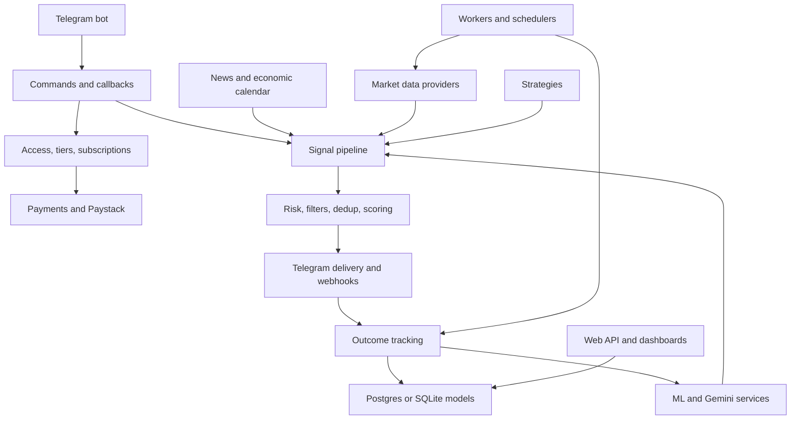
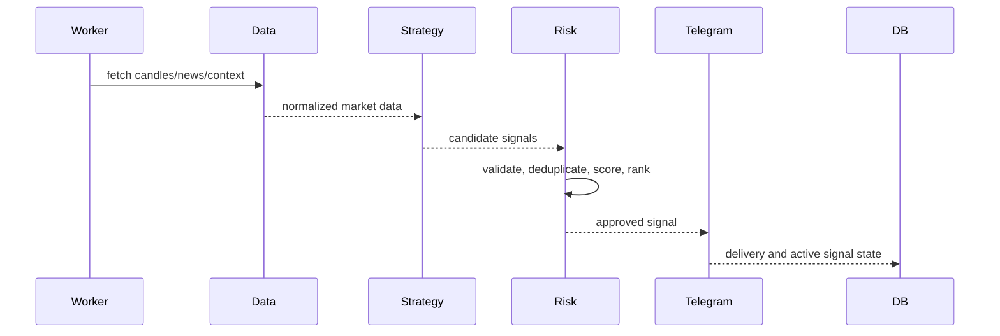
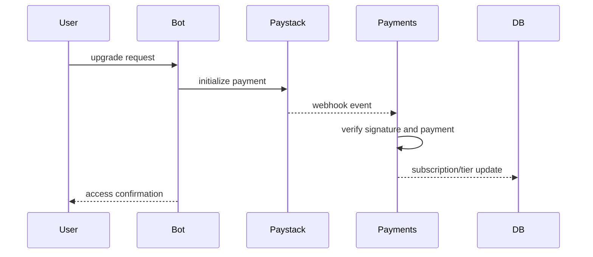
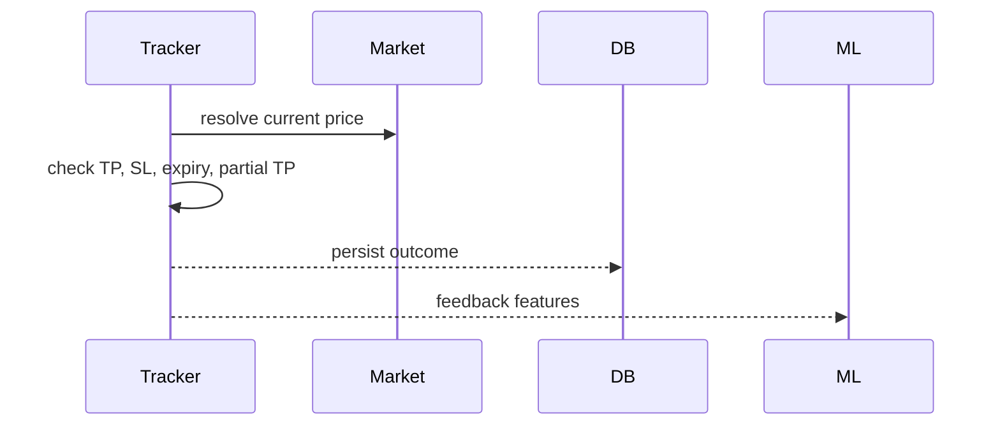
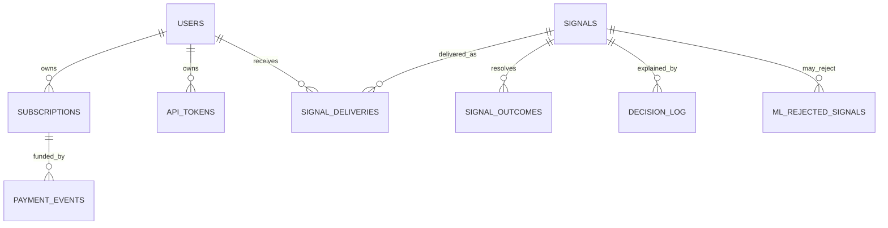

# SignalRankAI1 Audit, Merge, and Modernization Checkpoint

Date: 2026-06-29

## Scope Completed

- Audited both sibling projects: `SignalRankAI` as reference and `SignalRankAI1` as target.
- Built a fresh owned-artifact manifest excluding dependency/runtime internals: `.git`, `.venv`, `__pycache__`, and `.pytest_cache`.
- Copied all 150 reference-only project-owned artifacts into `SignalRankAI1`.
- Re-ran manifest comparison: `SignalRankAI1` now has all 599 reference-owned artifacts plus 6 target-only owned artifacts.
- Preserved target-specific divergent implementations instead of bulk-overwriting them. There are 84 same-path files that still intentionally differ by content, but the same-path Python symbol gap scan is now closed at 0 files.
- Completed a second compatibility pass for DB/session helpers, data/news/provider helpers, ML aliases, Telegram callback constants, `/mode`, signal status helpers, scoring/ranking helpers, and analytics helpers.
- Completed the Phase 11/15 institutional/perfection pass for the remaining high-impact gaps: on-chain exchange-flow veto, realtime state-machine compatibility helpers, Telegram unknown-command handling, signal action keyboard callback safety, Gemini audit support, news intelligence, decision intelligence, and the living technical debt register.
- Ran full project-owned syntax verification and full test verification after the final changes.

Generated/runtime artifacts were inventoried but not merged or line-reviewed as product code:

- `.venv`, `.git`, `__pycache__`, and `.pytest_cache`
- Target generated/runtime count observed: 18,929 files
- Reason: these are dependency, VCS, bytecode, and cache internals. Merging or manually refactoring them would corrupt the application boundary. If a literal third-party/vendor byte audit is required, it should be performed as a separate supply-chain review against lockfiles and installed distributions.

## Project Inventory

- Reference owned artifacts: 599
- Target owned artifacts: 605, including this `AUDIT_MERGE_REPORT.md`
- Python source files after merge: 462 in `SignalRankAI1`
- Reference-only owned files remaining: 0
- Target-only owned files: 6
- Changed shared files remaining after fixes: 84
- Same-path Python symbol gaps remaining: 0

Major owned areas present in the target after merge:

- `admin`
- `alembic`
- `core`
- `data`
- `db`
- `docs`
- `engine`
- `market`
- `migrations`
- `ml`
- `payments`
- `paystack`
- `scripts`
- `services`
- `signalrank_discord`
- `signalrank_telegram`
- `storage`
- `strategies`
- `telegram`
- `tests`
- `utils`
- `web`
- `worker`

## Phase 11/15 Completion Addendum

Completed on 2026-06-29:

- Closed the previous same-path divergence follow-up by subsystem-safe review instead of wholesale overwrite.
- Verified owned artifact parity: reference-owned `599`, target-owned `605`, reference-only `0`, target-only `6`.
- Verified same-path Python API parity: `same_path_symbol_gap_files=0`.
- Added deterministic `services/news_intelligence.py` for source reliability, deduplication, fake-news risk, event classification, affected assets, volatility expectation, uncertainty, and signal action.
- Added `services/decision_intelligence.py` for structured decision records covering strategy votes, votes against, ML, Gemini, news, technicals, risk, market context, historical analogs, confidence calibration, shadow agreement, and outcome learning.
- Added `docs/LIVING_TECHNICAL_DEBT_REGISTER.md` with open and closed audit debt items.
- Added targeted tests for command contracts, risk asset classes, on-chain exchange-flow veto, TP dict parsing, news intelligence, and decision intelligence.

Verification:

- Focused same-path/contract tests: `23 passed, 6 warnings`.
- New intelligence tests: `4 passed`.
- Full test suite: `260 passed, 34 warnings`.
- Project-owned compile check: passed with `.venv`, `.git`, `__pycache__`, and `.pytest_cache` excluded.
- Full-directory compile including `.venv` is intentionally not used because vendored `ccxt` static dependency files inside `.venv` contain invalid generated imports unrelated to project-owned source.

## Production Launch Engineering Pass

Completed on 2026-06-29:

- Treated `SignalRankAI1` as the production project and stopped using the sibling reference project as the working target.
- Added enforceable governance validation: `scripts/validate_governance_docs.py`.
- Added governance tests: `tests/test_governance_docs.py`.
- Added deployment governance and launch operations artifacts:
  - `docs/LIVING_DEPLOYMENT_REGISTER.md`
  - `docs/PRODUCTION_LAUNCH_RUNBOOK.md`
- Updated `docs/GOVERNANCE_INDEX.md` so deployment and launch runbook artifacts are part of the living governance set.
- Integrated structured decision intelligence into the existing engine decision-log path by enriching `_log_decision()` metadata with `decision_intelligence` and validation output.
- Added ADR-004 documenting why decision intelligence enriches existing logs instead of replacing the production logging path before launch.
- Reconciled observability documentation with verified code evidence: `core/telemetry.py`, `/health`, `/healthz`, `/metrics/prometheus`, `/ops_health`, and telemetry tests exist; dashboards, alert ownership, and SLOs remain open production work.
- Updated the production readiness scorecard, performance register, testing register, feature register, and technical debt register with this evidence.

Verification:

- Governance validator: `Governance validation passed: 17 documents checked.`
- Focused production-pass tests: `12 passed`.
- Project-owned compile check: passed with `.venv`, `.git`, `__pycache__`, and `.pytest_cache` excluded.
- Full test suite: `263 passed, 34 warnings`.

## Architecture



## Key Data Flows

Signal generation:



Payment/subscription:



Outcome tracking:



## Database ERD



## Problems Found and Fixed

- Missing project modules: 150 owned files were present in `SignalRankAI` but absent from `SignalRankAI1`.
- Broken syntax: `FIX_INTEGRATION_GUIDE.py`, `admin/auto_kill.py`, and `engine/stale_signal_validator.py` failed compilation.
- Pytest collection leak: root `test_summary.txt` was being collected and failing UTF-8 decode.
- Missing webhook compatibility: `generate_webhook_payload` was absent from `engine.webhook_generator`.
- Explainability gap: nested `score_components.confluence` was ignored.
- VIP UX gap: VIP signal messages did not include a clear `Why:` line.
- Callback routing bug: `_parse_callback_data` split on the first underscore, so `mt5_trade_*` routed as `mt5`.
- Navigation bug: `nav_execution` did not route to `execution_command`.
- IMP strategy nondeterminism: default FX session gating made tests and behavior depend on wall-clock time.
- DB pooling mismatch: `DB_USE_NULLPOOL` default bypassed explicit pool caps.
- Provider merge artifact: `_fetch_binance_ccxt_sync` had its body stranded in unreachable code.
- Trade tracker behavior: stop-loss checks recalculated entry reach from current price, breaking active trade SL detection.
- Trade tracker latency risk: provider waterfall ran after direct price failure, causing repeated network calls before backoff.
- Web API resilience: token rotation let DB connection failures bubble instead of returning `503`.
- Missing tier metadata aliases: price/display/cooldown constants from the reference were absent while target tier policy needed to remain intact.
- Missing data quality/provider helpers: provider error tracking, quality counters, degraded candle minimums, multi-source validation, Bybit discovery, yfinance ticker variants, macro rate limiting, and high-impact news helper APIs were absent.
- Missing DB/session compatibility surface: sync session, database URL normalization, PG env-var DSN construction, engine disposal/init helpers, and explicit `db.database` wrappers were absent.
- Missing ranking/scoring intelligence helpers: confidence component scoring, composite score metadata, score labels, and related component helpers were absent.
- Ranking regression: composite confidence blending changed the existing live-strategy-weight tiering contract; fixed by preserving `score_final` as the live-weighted score and storing composite confidence separately.
- Missing Gemini/ML compatibility helpers: Gemini availability/call/explanation/sentiment wrappers and ML dynamic threshold/AUC/training-data aliases were absent.
- Missing Telegram compatibility and UX routes: callback constants/router aliases, `/mode` command registration, signal status helpers, and catch-all unknown-command ordering needed correction.
- Missing analytics/economic-calendar helpers: regime analytics, Redis/DB economic calendar cache loaders, and volatility buffer info were absent.

## Files Modified

- `FIX_INTEGRATION_GUIDE.py`
- `admin/auto_kill.py`
- `engine/stale_signal_validator.py`
- `pytest.ini`
- `engine/webhook_generator.py`
- `engine/signal_metrics.py`
- `signalrank_telegram/tier_signal_formatter.py`
- `signalrank_telegram/callback_handlers.py`
- `signalrank_telegram/commands.py`
- `strategies/imp.py`
- `db/session.py`
- `data/providers.py`
- `core/trade_tracker.py`
- `web/api.py`
- `core/command_limits.py`
- `core/tier_constants.py`
- `conftest.py`
- `data/fetcher.py`
- `data/market_data.py`
- `data/pair_discovery.py`
- `data/providers.py`
- `db/access.py`
- `db/database.py`
- `db/pg_features.py`
- `db/repository.py`
- `engine/advanced_filters.py`
- `engine/analytics.py`
- `engine/onchain_alpha.py`
- `engine/ranking.py`
- `engine/regime.py`
- `engine/risk.py`
- `engine/scoring.py`
- `engine/signal_deduplicator.py`
- `engine/tier_notifications.py`
- `ml/inference.py`
- `ml/train_model.py`
- `services/economic_calendar.py`
- `services/gemini_ml.py`
- `signalrank_telegram/bot.py`
- `signalrank_telegram/formatter.py`
- `signalrank_telegram/signal_commands.py`
- 150 previously missing owned artifacts copied from `SignalRankAI`

## Verification

Commands run from `SignalRankAI1`:

```powershell
.\.venv\Scripts\python.exe -m compileall -q -x "(\\.venv|__pycache__|\\.git|\\.pytest_cache)" .
.\.venv\Scripts\python.exe -m pytest -q
```

Results:

- Compile: passed
- Focused regression batch: 30 passed, 11 warnings
- Ranking regression check: 1 passed
- Full test suite: 250 passed
- Warnings: 34, mostly `datetime.utcnow()` deprecations and pandas frequency deprecations

## Risk Register

| Priority | Risk | Impact | Mitigation |
| --- | --- | --- | --- |
| Critical | Live `.env` contains production-like DB settings | Tests or local tools can hit live services | Keep tests hermetic and prefer test env overrides |
| Critical | 84 divergent shared files remain | Reference and target behavior may still drift | Review by subsystem and merge intentionally |
| High | `datetime.utcnow()` deprecations across runtime | Future Python compatibility and timezone bugs | Convert to timezone-aware UTC helpers |
| High | Many root-level fix scripts and TODO files | Operational confusion and accidental script use | Move legacy diagnostics to `docs/archive` after review |
| High | Web/API DB calls depend on environment state | Local smoke tests can be non-hermetic | Add dedicated test DB fixture or dependency overrides |
| Medium | `.venv` and caches exist inside project folders | Large scans, accidental packaging, noisy tooling | Keep ignored and exclude from audit/test tooling |
| Medium | News/Gemini/provider behavior depends on external APIs | Rate limits and flaky tests | Add provider fakes and integration-test markers |

## Roadmap

Critical:

- Review the 84 divergent same-path files by subsystem.
- Remove live-service dependency from default tests.
- Add a `.env.test` or pytest env fixture.
- Harden secret handling and confirm `.env` is never committed or copied to deploy artifacts.

High:

- Normalize all UTC handling.
- Add migration smoke tests.
- Add callback/keyboard contract tests for all Telegram buttons.
- Add provider mock tests for each market data adapter.
- Add webhook signature tests.

Medium:

- Archive legacy scripts and historical fix plans.
- Generate a full import/dependency graph in CI.
- Add news intelligence fixtures and source reliability tests.
- Add ML drift and calibration regression fixtures.

Low:

- Consolidate documentation.
- Add ADRs for signal lifecycle, payment lifecycle, and data provider policy.

## Regression Checklist

- Imports compile cleanly.
- All tests pass.
- Full suite verified on 2026-06-29: 250 passed.
- Telegram callback queries answer immediately.
- Signal explanation metadata is present in VIP messages and webhook payloads.
- Trade tracker handles TP, SL, partial TP, backoff, and cached prices.
- DB engine pool settings cap Railway runtime while keeping normal local defaults.
- Provider proxy configuration reaches CCXT sync path.
- Token API returns `503` for unavailable DB instead of crashing.

## Remaining Work

This checkpoint completes the first safe merge, compatibility, and stabilization pass. `SignalRankAI1` now contains every reference-owned file from `SignalRankAI`, compiles cleanly, and passes the full local test suite.

Remaining intentionally divergent areas should be handled by subsystem review rather than blind file replacement. The current missing-reference-symbol inventory is concentrated in:

- `engine/core.py`
- `engine/realtime_outcome_tracker.py`
- `strategies/fallback.py`
- selected reference-only tests that describe extra future behavior

Important retained target behavior:

- `engine.ranking.rank_signals()` keeps tier allocation based on the existing live-strategy-weight contract while exposing `score_composite` and confidence components as metadata.
- `engine.risk.calculate_position_size()` keeps legacy risk-distance sizing by default; asset-class exposure caps are opt-in through `POSITION_SIZE_ENFORCE_ASSET_CAPS` or signal metadata.
- `db.pg_features.compute_signal_fingerprint()` keeps the target's candle-aware fingerprint contract while retaining the newly merged DB lock/cooldown helpers.
- Telegram unknown-command handling is registered last so it cannot shadow real commands.
