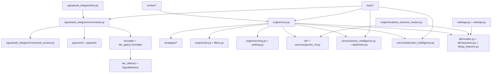

# Knowledge Graph

Last updated: 2026-06-29
Owner: Engineering

This document maps the major relationships between files, classes, functions,
commands, database models, APIs, Telegram messages, strategies, ML models, news
sources, and tests. It is intentionally high-signal; future automation can expand
it into a generated graph.

## Core Graph

## Important Nodes

| Node | Files | Connected To | Notes |
| --- | --- | --- | --- |
| Telegram command layer | `signalrank_telegram/bot.py`, `commands.py`, `user_commands.py`, `owner_commands.py` | Users, DB, payments, signals, outcomes | Needs full E2E workflow verification. |
| Trading engine | `engine/core.py` | Strategies, data, ML, news, risk, DB | Main lifecycle orchestrator. |
| Decision log | `db.models.DecisionLog`, `db.repository.persist_decision_log` | Engine, decision intelligence, admin pulse | Structured decision records should flow here. |
| News intelligence | `services/news_intelligence.py` | Data providers, engine, decision records | Deterministic evidence scoring. |
| Shadow intelligence | `MLShadowPrediction`, `engine/shadow_outcome_worker.py`, `ml/ml.py` | ML, outcomes, decision intelligence | Requires promotion governance. |
| Outcome tracking | `engine/realtime_outcome_tracker.py` | Market prices, DB, Telegram, ML | Polling tracker plus state-machine compatibility helpers. |
| Web platform | `web/app.py`, `web/api.py` | DB, API tokens, dashboards | Enterprise dashboard maturity pending. |

## Test Mapping

| Behavior | Tests |
| --- | --- |
| Governance documents | `tests/test_governance_docs.py` |
| News intelligence | `tests/test_news_intelligence.py` |
| Decision intelligence | `tests/test_decision_intelligence.py` |
| Telegram command contracts | `tests/test_command_contracts.py` |
| Risk and asset classes | `tests/test_risk_dynamic.py` |
| On-chain provider context | `tests/test_onchain_providers.py` |
| Outcome persistence and TP parsing | `tests/test_time_stop_outcome_persistence.py`, `tests/test_realtime_outcome_tracker_user_perf_ids.py` |
