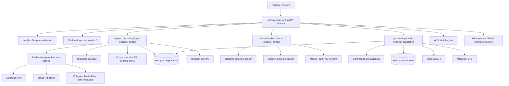
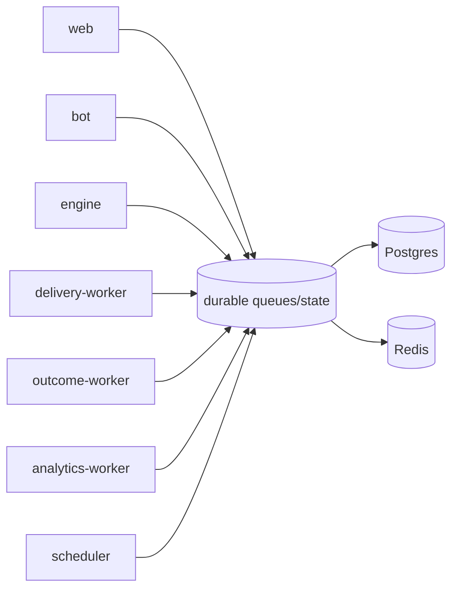
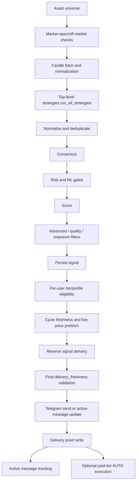

# Phase 1 — Full Codebase Comprehension

Date: 2026-07-14
Repository: `SignalRankAI1`
Audited checkout: branch `fix-2`, commit `ca616b11043683aaa5a5c01702f292a5a5c42591`
Baseline disposition: authorized by the user on 2026-07-14 as the canonical replacement for the unavailable Pass 7 archive
Phase verdict: **Not ready**
Change scope: documentation only; no runtime, schema, configuration, or test behavior was changed.

## 1. Executive conclusion

The checkout contains a broad trading platform with substantial working logic: multi-provider candle ingestion, a large synchronous production signal pipeline, score/risk/quality gates, Telegram delivery reservations and proof, tier-aware formatting, live outcome tracking, Redis/Postgres state, MT5/MetaApi execution foundations, paper trading, Gemini/ML components, and Railway deployment support.

It is not the originally named `SignalRankAI1_phase4_pass7_module_decomposition_fixed.zip` baseline. That archive was not present in the repository, Desktop, Downloads, or the supplied attachment directory, and the expected Pass 7 artifacts are absent. After this finding was reported, the user explicitly designated the checked-out `ca616b1` codebase as the canonical replacement baseline. All subsequent phases therefore use this checkout and preserve its observed working behavior; missing Pass 7 capabilities remain product gaps rather than assumed existing work.

The current checkout is also not production-ready. The most consequential findings are:

1. The production web composition is invalid: a Flask application is mounted directly as ASGI, and the catch-all mount precedes later TradingView routes. Tests reproduce `TypeError` on ASGI requests.
2. Paystack and broker/API web contracts expected by tests are missing from `web/app.py`; the alternate Paystack router is not mounted and imports functions that do not exist in its payment module.
3. The exact test command stops during collection. Running all otherwise collectable tests produced **406 passed, 31 failed, 2 errors**.
4. Final live-price validation is present but does not yet prove a truly fresh source quote immediately before every send. Previous-close and untimestamped DB fallbacks can be stamped or treated as current.
5. Delivery proof is much stronger than a naive send path, but receipt stashing/reconciliation and monotonic success protection required by the brief are absent.
6. Outcome detection, lifecycle transitions, and notification delivery are duplicated across several paths. The required Redis outcome snapshot fast path is absent.
7. Alembic has three migration trees. The configured tree ends at `0019_user_timezone_privacy`; later outcome/delivery migrations and the concurrent delivery-index migration are not in the active tree.
8. The Railway monolith runs web, engine, worker, scheduler, bot, and up to 64 webhook workers in one process against a very small DB pool. This defeats the required role isolation and enlarges every failure domain.
9. Security foundations exist, but public web enablement would be unsafe: numeric-ID dashboard login, default Flask secret, unauthenticated token management endpoints in the alternate API, a default API-token pepper, and no global AUTO-trade launch gate in the active auto-execution path.
10. ML and prompt governance are incomplete. Several prompts remain hardcoded, AI version fields are not durable on normal signals, and offline synthetic bootstrap training is enabled by default with a ten-row minimum.

No claim about a 60% win rate is supportable from this audit. Backtest and WFO utilities exist, but there is no integrated, provenance-aware promotion system proving performance after spread, slippage, latency, missed entry, and live delivery effects.

## 2. Baseline identity and repository shape

### 2.1 Exact baseline observed

| Item | Observed value |
|---|---|
| Branch | `fix-2` |
| Commit | `ca616b11043683aaa5a5c01702f292a5a5c42591` |
| Commit date | `2026-07-11T02:00:09+01:00` |
| Files found by `rg --files` | 692 |
| Python files | 529 |
| Working tree before this report | Clean |
| Configured Alembic head | `0019_user_timezone_privacy` |

The latest commit includes Phase 4 Pass 1-style changes such as `data/get_live_price.py`, `engine/delivery_freshness.py`, `engine/off_market.py`, prompt configuration, and rich-message scaffolding. It does not contain the required complete Pass 7 decomposition.

### 2.2 Missing expected baseline artifacts

These named artifacts from the required baseline are absent:

- `core/tier_policy.py`
- `signalrank_telegram/signal_buttons.py`
- `core/env.py`
- `engine/pipeline_types.py`
- `data/provider_types.py`
- `db/features/__init__.py`
- `scripts/architecture_smoke.py`
- `engine/outcome_snapshots.py`

The largest modules remain god modules:

| Module | Approximate lines |
|---|---:|
| `signalrank_telegram/bot.py` | 7,668 |
| `signalrank_telegram/commands.py` | 7,097 |
| `engine/core.py` | 4,109 |
| `db/pg_features.py` | 3,231 |
| `data/fetcher.py` | 2,276 |

There are also many tracked root-level diagnostic, temporary, fix, and manual test scripts. They increase ambiguity around supported entrypoints and release content.

## 3. Architecture map

### 3.1 Deployed topology as coded today

This is a single-process monolith in normal Railway configuration. Engine and worker default on, scheduler starts, Telegram initializes in the background, and bot jobs add more outcome, execution, cleanup, and notification work.

### 3.2 Other runtime paths

| Path | Behavior | Finding |
|---|---|---|
| `railway.json` | Runs `bash start.sh` and checks `/healthz` | Primary declared Railway path |
| `nixpacks.toml` | Directly starts `uvicorn railway_main:app` | Competing start declaration; still monolith |
| `main.py`, `RUN_MODE=all` | Delegates to `railway_main:app` | Monolith |
| `main.py`, `RUN_MODE=engine` | Runs `engine.core.main_loop` | Valid dedicated engine foundation |
| `main.py`, `RUN_MODE=worker` | Runs `worker.worker.main` | Valid dedicated worker foundation |
| `main.py`, `RUN_MODE=bot` | Runs polling bot | Different delivery mode from production webhook |
| `main.py`, `RUN_MODE=web` | Runs Uvicorn against Flask `web.app:app` | Invalid WSGI/ASGI combination |
| `Procfile` worker | Sets `MODE=worker` | `main.py` reads `RUN_MODE`, so this declaration does not select worker mode |
| `engine/loop.py` | Separate async signal pipeline | Not the default production engine; behavior diverges from `engine/core.py` |
| `web/api.py` | Separate FastAPI signal/token API | Not mounted by `railway_main.py` |

### 3.3 Intended target topology implied by the brief

The existing code has enough boundaries to evolve, but does not yet implement this target:

Role separation is mandatory because provider latency, engine cycles, outcome scans, bot interactions, migrations, and analytics should not share one process and one tiny connection budget.

## 4. Core data flows

### 4.1 Startup and deployment

1. Railway starts `start.sh` (or the Nixpacks command, depending on platform precedence).
2. Production normally starts `railway_main:app`.
3. FastAPI lifespan schedules DB startup operations and maintenance, often without waiting on Railway.
4. Engine and worker loops start in executor threads after a delay.
5. A scheduler starts, a Telegram webhook application is initialized with retry, and webhook workers begin consuming Redis/in-process queues.
6. `/healthz` returns `status="healthy"` even when dependencies or subsystems are unavailable. It is a liveness response, not a readiness result.

Hidden startup concerns:

- `main.py` rethrows settings validation inside an inner block and immediately swallows it in an outer `except Exception`, so required setting validation is not actually fatal there.
- Startup DB operations include schema manipulation outside a single authoritative migration flow.
- The application can become HTTP-healthy while migrations, bot startup, engine, worker, or DB work is still failed/degraded.
- `_redis_queue_requested()` always returns `True`; runtime later falls back to an in-process queue if Redis is unavailable.

### 4.2 Production signal generation and delivery

Important current behavior:

- Production uses the top-level `strategies` package, not `engine/strategies/signal_generator.py`.
- `RUN_ALL_STRATEGIES` and fallback strategies default on. The HTF direction filter is explicitly relaxed.
- Several validation layers fail open in the engine prefilter path. The final Telegram delivery validator is stricter for required live prices, but does not force a new provider fetch by default.
- The engine prefetches one price per asset for delivery preparation, then the Telegram layer validates again.
- A successful send is represented by a Telegram message ID proof, and delivery reservation precedes send. This is a meaningful strength.
- The idempotency key is effectively user/signal, not user/signal/channel.
- A failure update can overwrite a previous successful delivery row because result updates are not monotonic.
- If active-message or proof persistence fails after Telegram accepts a send, there is no Redis receipt stash plus reconciliation path required by the brief.

### 4.3 Final live-price validation

`data/get_live_price.py` returns a structured `LivePriceQuote` with provider, fetch time, latency, confidence, and stale fields. `engine/delivery_freshness.py` checks queue age, signal age, live price availability, entry drift, consumed targets, stop loss, and current risk/reward.

Gaps that prevent the non-negotiable freshness guarantee:

- `FINAL_SEND_FORCE_FRESH_PRICE` defaults false, so an attached/cached `current_price` may be reused at final send.
- Quote age is based on local fetch completion, not consistently on the provider's market timestamp.
- Yahoo fallbacks can use `previousClose` or `chartPreviousClose` and then stamp the result as fetched now.
- Polygon's previous-day aggregate is a fallback for instruments that require a current quote.
- The DB market-tick fallback does not enforce source timestamp freshness.
- Quote confidence is effectively constant rather than calculated from provider/source quality.
- Market-hours logic is split across multiple modules with inconsistent FX session definitions.

Therefore, “a validation function ran” is proven; “every delivered signal used a trustworthy fresh quote obtained immediately before send” is not.

### 4.4 Telegram command and callback flow

1. Telegram posts to `/telegram/webhook`.
2. The request is enqueued in Redis or the in-process queue.
3. A webhook worker creates a PTB `Update` and dispatches it to registered handlers.
4. Callback handlers include a fast ACK group, then multiple specific inline handlers, followed by a global callback router.
5. Commands use a mixture of interactive, default, and noncritical DB sessions plus Redis caches.

Strengths:

- Callback ACK infrastructure exists.
- Command timeouts, user-visible timeout references, Telegram retry/flood controls, and DB interactive priority exist.
- Rich messages are behind `TELEGRAM_RICH_MESSAGES_ENABLED` and default off with normal-message fallback.

Debt and hidden coupling:

- `bot.py` registers a very large handler surface and also owns delivery, outcomes, execution, scheduling, cleanup, and monitoring.
- `commands.py` imports some decomposed command handlers and later redefines functions with the same names, shadowing the imports.
- Several callback behaviors exist both inline in `bot.py` and in `callback_handlers.py`; registration order determines which implementation wins.
- Signal buttons are constructed in several modules rather than one shared module.
- `Check Outcome` reads DB/live sources and has no required Redis outcome snapshot fast path.

### 4.5 Outcome and lifecycle flow

Current outcome work can occur in:

- `worker/worker.py` through `engine/realtime_outcome_tracker.py`
- `engine/core.py` through `core.trade_tracker`
- Telegram scheduler jobs in `signalrank_telegram/bot.py`
- `engine/signal_monitor.py`
- `engine/shadow_outcome_worker.py`
- lifecycle helpers and notification tables

The worker tracker defaults on and scans active/delivered signals, but it fetches live prices per signal rather than building the required one-price-per-asset cycle cache. It has no `engine/outcome_snapshots.py`. Detection and notification are not consistently separated into independent workloads.

There are three incompatible lifecycle vocabularies:

- DB `SignalLifecycle`
- `core/signal_lifecycle.py`
- `engine/signal_lifecycle.py`

The mandated candidate-to-terminal state machine is not implemented as one authoritative transition graph. Additionally, lifecycle recipient selection expects `delivery_state == "confirmed"`, while the active proof path writes values such as `"sent"` or `"updated"`. That can leave lifecycle notification queues empty even after valid sends.

Progression guards and idempotency logic exist in parts of the outcome code, but duplicate pipelines and inconsistent state names make whole-system monotonicity unproven.

### 4.6 Payment, subscription, referral, and waitlist flow

There are at least three payment implementations:

- `payments/paystack.py`
- `payments/paystack_webhook.py`
- `paystack/paystack.py`

The current production app does not mount `payments.paystack_webhook.router`. That router imports `verify_webhook_signature`, `PAYSTACK_WEBHOOK_IP_WHITELIST`, and event processors from `payments/paystack.py`, but those symbols are not defined there. The Telegram payment handler calls `activate_subscription` with parameters that do not match `db.repository.activate_subscription`.

Tests expect payment, waitlist, referral, and broker API helpers in `web.app`; the checked-out file is only a small Flask dashboard and does not contain them. `config.py` defaults `PAYMENTS_ENABLED` to true, which conflicts with the requested safe-launch default even though the current endpoint is not functional.

Existing positive foundations include HMAC helpers, Paystack transaction verification, processed-webhook models/repository helpers, reference uniqueness, tier/duration metadata, and manual verification being disabled in the legacy flow. They are not connected into one tested production path.

### 4.7 MT5, paper, copy, and AUTO execution flow

The active Telegram AUTO path is the strongest broker path. It requires:

- a delivered signal routed to Premium/VIP,
- persisted `execution_mode=auto`,
- an explicit runtime-state opt-in,
- a linked executable account,
- valid entry/SL/TP,
- slippage validation,
- Premium daily cap or VIP risk sizing,
- drawdown protection,
- and a hard stop passed to MetaApi.

It also records executions, reconciles broker positions, has smart-exit/drawdown jobs, and has a kill-switch close-all watchdog.

Important gaps:

- There is no global `AUTO_TRADE_ENABLED` launch gate in the active delivery-to-execution function. Existing opted-in DB state can therefore execute when a signal is delivered.
- Kill-switch checking happens in dispatch/watchdog paths, but is not a final atomic pre-order guard inside the order-placement block.
- The alternate `services/mt5_signal_router.py` retrieves tier but does not enforce it itself, uses Redis idempotency that fails open, marks idempotency before knowing execution success, and its user risk lookup returns a hardcoded 1%.
- Execution logic is duplicated again in `engine/tiered_executor.py` and `services/trading_mode_manager.py`.
- Paper trading persists through runtime-state-style records and is not yet an execution-grade, provenance-separated ledger.
- Copy-trade constants and routing foundations exist, but a disabled-by-default verified copy workflow is not one authoritative path.

Credential encryption correctly fails when Fernet is unavailable, and MT5 command messages are deleted best-effort, but chat credential capture remains a sensitive workflow that needs an explicit disable flag and redaction tests.

### 4.8 AI/ML and performance flow

Available foundations:

- Gemini and local review paths
- a JSON prompt registry
- ML inference and schema evolution
- time-ordered training split and isotonic calibration
- drift monitoring and threshold adjustment
- shadow prediction/outcome tables
- backtest and walk-forward utilities
- strategy ranking/weights

Gaps:

- Several Gemini prompts remain hardcoded in `services/gemini_ml.py`, `engine/core.py`, and other business logic.
- Prompt version is attached to some in-memory dictionaries, but the normal `Signal` model has no durable prompt/model provenance fields.
- `ML_OFFLINE_BOOTSTRAP_ENABLED` defaults true and `ML_MIN_TRAIN_ROWS` defaults to 10. Synthetic rows can therefore produce and save a model when production truth data is insufficient.
- Multiple retraining/threshold systems use different minimum samples and rules.
- Backtest/WFO results are not a mandatory promotion gate for live strategy segments.
- Outcomes are not consistently separated by backtest, shadow, paper, manual, copy, and live provenance.
- No single report provides win rate, TP-level hit rates, missed/expired rates, average R, expectancy, drawdown, profit factor, sample size, and methodology by the required dimensions.

## 5. Subsystem and feature inventory

| Subsystem / feature | Primary implementation | State observed |
|---|---|---|
| Railway monolith | `railway_main.py` | Active; oversized failure domain |
| Dedicated mode launcher | `main.py` | Partial; web/Procfile defects |
| Telegram webhook queue | `railway_main.py`, `core/redis_state.py` | Active; Redis plus process-local fallback |
| Telegram commands | `signalrank_telegram/commands.py` | Extensive; god module and shadowed decompositions |
| Callback routing | `bot.py`, `callback_handlers.py` | Active; duplicated handlers |
| Rich Messages | `rich_messages.py` | Correctly disabled by default; scaffold only |
| Production engine | `engine/core.py` | Active; synchronous god pipeline |
| Alternate async engine | `engine/loop.py` | Present; divergent/non-default |
| Production strategy runner | `strategies/__init__.py` | Active; fallback default on, HTF relaxed |
| Alternate strategies | `engine/strategies/*` | Present; separate scoring behavior |
| Candle fetch layer | `data/fetcher.py` | Active; large and multi-provider |
| Final quote layer | `data/get_live_price.py` | Structured but source-freshness gaps |
| Provider registries | multiple `data/`, `services/`, `core/` modules | Fragmented; no one typed provider contract |
| Market hours | multiple data/engine modules | Fragmented and inconsistent |
| Signal risk/scoring | multiple engine modules | Extensive; overlapping rules/defaults |
| Delivery reservation/proof | `db/pg_features.py`, `bot.py` | Active; strong base, repair/monotonic gaps |
| Active message tracking | DB plus Telegram send path | Active; no durable failed-write receipt repair |
| Outcome tracking | worker, engine, bot paths | Active but duplicated |
| Outcome snapshots | expected `engine/outcome_snapshots.py` | Missing |
| Lifecycle state machine | DB/core/engine variants | Inconsistent |
| DB priority | `db/session.py` | Interactive/critical/noncritical; analytics not distinct |
| Postgres migrations | `db/migrations/versions` | Active tree only through 0019 |
| Runtime DDL | `db/auto_ops.py` | Active; bypasses safe migration discipline |
| Redis state | `core/redis_state.py` | Redis, Postgres, and memory fallbacks |
| Tier policy | `core/tier_constants.py`, `services/tier_policy.py`, Telegram modules | Partial; no canonical `core/tier_policy.py` |
| User profiles | user intelligence/trade profile modules | Present and used in delivery |
| Paper trading | `core/paper_ledger.py` | Foundation present |
| MT5/MetaApi | `services/mt5_client.py`, bot, routers | Foundation active; duplicated control planes |
| Copy trading | trading mode constants/routing | Foundation only; not one safe disabled path |
| Paystack | three implementations | Broken/unmounted production contract |
| Subscription/referral/waitlist | DB, bot, services | Broad code present; web contract missing |
| Signal API | `web/api.py` | Separate and unmounted |
| Dashboard | `web/app.py` | Insecure placeholder; invalid production mount |
| API tokens | repository + `web/api.py` | Hashing/revoke present; management auth unsafe if mounted |
| Gemini prompts | registry + hardcoded strings | Partial decoupling |
| ML training/inference | `ml/*` | Broad foundation; unsafe bootstrap/promotion defaults |
| Backtest/WFO | `engine/backtest.py`, `engine/wfo.py` | Utilities exist; not a truth/promotion system |
| Metrics | `core/telemetry.py`, `railway_main.py` | Metrics created; no production exposition endpoint |
| Sentry/OTel | logging/telemetry | Optional foundation |
| Readiness | `/healthz`, readiness script | Liveness only; readiness script fails |
| Architecture smoke | expected script | Missing |

## 6. Database and state map

### 6.1 Main persistent domains

`db/models.py` covers users, subscriptions, signals, outcomes, strategy statistics, admin events, alert preferences, referrals/rewards, free queues, signal deliveries/corrections/engagements, active messages, lifecycle events/notifications, economic events, MT5 credentials/executions, VIP waitlist, API tokens, user webhooks, processed webhook events, payments, bot events, runtime state, market ticks/candles, provider/proxy/live metrics, managed assets, ML shadow/rejected/archive data, trades, and decision logs.

`db/mt5_models.py` defines another broker model family with overlapping account, position, and execution concepts. This is schema ownership duplication.

### 6.2 Session and pool behavior

- Railway pool is capped to 2 with overflow 0 by default.
- A process-wide bounded session semaphore gates work.
- Loop-specific async engines are maintained; auxiliary loops can use `NullPool` on Railway.
- `interactive=True` prioritizes commands/buttons.
- `critical=True` is intended for storage/proof/payment-grade work.
- `noncritical=True` combines background and analytics, and can drop/defer.
- There is no separate analytics class as mandated.

Because `railway_main.py` owns multiple event loops/threads and many scheduled tasks, the apparent pool size does not fully describe connection churn or fairness.

### 6.3 Migration divergence

Configured by `alembic.ini`: `script_location = db/migrations`.

Active tree:

- `db/migrations/versions/0001_init.py` through `0019_user_timezone_privacy.py`

Inactive alternate tree:

- `alembic/migrations/versions/0009...` through `0025_unique_outcome_signal_id.py`

Inactive alternate tree:

- `alembic/versions/0015...` through `0017_concurrent_signal_delivery_indexes.py`

Consequences:

- Outcome truth/delivery-state migrations `0023`–`0025` are not applied by the configured Alembic command.
- The concurrent signal-delivery index migration is not applied by the configured command.
- `db/auto_ops.py` creates/alters/indexes at startup, often with ordinary `CREATE INDEX IF NOT EXISTS`, so production schema state can depend on runtime code and can lock active tables.
- Schema behavior cannot be inferred reliably from Alembic head alone.

## 7. Hidden dependencies and coupling

| Hidden dependency | Why it matters |
|---|---|
| Registration/import order in `bot.py` | Determines which duplicate callback implementation handles a tap |
| Function redefinition order in `commands.py` | Later definitions shadow imported decomposed handlers |
| Route registration order in `railway_main.py` | The `/` mount precedes TradingView routes and intercepts them |
| Flask passed to ASGI servers | Import succeeds, but the first ASGI request fails at call signature |
| `run_sync` and executor threads | Creates extra event loops and loop-specific DB engines |
| Redis availability | Changes queue, dedupe, locks, kill-switch, limits, and cache semantics |
| Runtime-state table fallback | Makes “cache” operations perform synchronous Postgres work |
| DB proof states | Lifecycle notifications depend on exact strings such as `confirmed` vs `sent` |
| Environment defaults | Feature behavior changes at import time across many modules |
| `RUN_MODE` vs `MODE` | Procfile worker declaration silently selects the default engine |
| Active vs alternate module families | Similar names do not imply production use (`engine/core.py` vs `engine/loop.py`) |
| Provider symbol heuristics | Misclassification changes provider, market-hours, freshness, and risk rules |
| Local time and naive UTC datetimes | Deprecations and timezone comparisons affect expiry/lifecycle logic |
| Tiny DB pool plus 64 webhook workers | Queue concurrency can greatly exceed storage concurrency |
| Tests that inspect source strings | Refactors can fail tests despite equivalent behavior; current suite has stale contracts |
| Python version | Deployment declares Python 3.11; local verification ran under Python 3.13 |

## 8. Failure-domain map

| Failure domain | Current containment | User/system effect |
|---|---|---|
| Railway process crash/OOM | Platform restart only | Web, bot, engine, worker, scheduler, outcomes all stop together |
| Engine blocking/stall | Executor thread and monitor restart | Can still consume DB/provider resources and affect commands |
| Worker/outcome overload | Background gates and task restart | Outcome lag, DB pressure, duplicated scans |
| Postgres/PgBouncer saturation | Session gate, tiny pool, noncritical drops | Commands time out; proof/outcome work may lag or drop |
| Redis outage | In-process/Postgres/memory fallbacks | Cross-process idempotency/locks/queue durability weaken |
| Provider outage/staleness | Multiple fallbacks/circuit breakers | Some paths fail closed; others accept stale or fail open |
| Telegram timeout after accepted send | Reservation and message proof | Ambiguous send can lack durable proof; retry may duplicate |
| Active-message DB failure | Log and continue | Sent message may become untracked and unreconcilable |
| Migration lock/failure | Startup continues/degrades | Mixed schema, runtime errors, traffic blocking |
| Payment webhook failure | No working production route | No trustworthy automatic activation/renewal |
| Flask web request | No containment | ASGI `TypeError`; catch-all also shadows later routes |
| Outcome pipeline race | Partial guards/idempotency | Backward state, duplicate/missing notification risk |
| AUTO execution failure/race | User opt-in, limits, reconciliation | Live-money risk; no single atomic global safety gate |
| Model drift/bad retrain | Drift tooling and calibration | Synthetic/low-sample model can still be saved/promoted |
| Misconfiguration | Warnings and broad fallbacks | Service may report healthy while core subsystems are off/broken |

## 9. Current production risk register

### Resolved prerequisite

**P1-R01 — Canonical baseline selected.**

The originally named Pass 7 archive was unavailable, but the user explicitly designated branch `fix-2` at commit `ca616b1` as its canonical replacement on 2026-07-14. Baseline identity is therefore no longer a blocker. Missing Pass 7 artifacts remain implementation gaps and must not be treated as already delivered.

### Critical

**P1-C02 — Web runtime composition is broken.**

`railway_main.py` mounts a Flask WSGI application directly into FastAPI/Starlette. Tests reproduce Flask/ASGI call-signature errors. The catch-all mount is registered before TradingView routes, so those later routes are intercepted.

**P1-C03 — Public payment activation is not a valid end-to-end path.**

The Paystack router is unmounted, imports nonexistent symbols, and subscription activation signatures disagree. Required amount/currency/tier/user/signature/idempotency checks are not one connected tested transaction. Payments must stay disabled.

**P1-C04 — Freshness guarantee is not proven.**

Final validation can reuse cached/attached prices; some providers expose previous-close data as newly fetched; DB tick age is unchecked. Premium/VIP delivery can therefore pass logic without a trustworthy current market timestamp.

**P1-C05 — Delivery success is not durably monotonic/reconcilable.**

There is no required receipt stash and repair job, and late failure writes can overwrite prior success. A Telegram-accepted message can remain untracked after DB failure.

**P1-C06 — Production schema is not governed by one safe migration chain.**

Two later migration trees are inactive, while startup DDL can use blocking index creation on active tables. Schema truth and launch safety are not auditable.

**P1-C07 — Baseline verification is red.**

Exact pytest collection fails; the remaining suite has 31 failures and 2 errors. Architecture smoke is missing and the readiness check fails.

**P1-C08 — AUTO execution lacks the requested global launch gate.**

The active path has strong user/tier/risk checks, but no final `AUTO_TRADE_ENABLED=1` requirement. Persisted opt-in state can place live orders after delivery. This conflicts with the stated launch policy.

### High

**P1-H01 — Outcome architecture is duplicated and snapshot-free.**

Multiple scanners and notifiers compete; the required one-price-per-asset scan and Redis snapshot-first `Check Outcome` path are absent.

**P1-H02 — Lifecycle state is not authoritative.**

Three state vocabularies and delivery-state string drift can suppress or misorder lifecycle events.

**P1-H03 — Service roles share one process and DB budget.**

Provider stalls, engine cycles, 64 webhook workers, outcome scans, ML, and scheduler work can affect user-facing latency and fail together.

**P1-H04 — Web/API security is unsafe if exposed.**

The Flask dashboard accepts a numeric user ID, defaults its secret to `changeme`, and references an undefined `ENGINE`. The alternate token rotate/current endpoints trust a supplied Telegram user ID and have no caller authentication. The token pepper has a public default.

**P1-H05 — Payment-safe default is wrong.**

`PAYMENTS_ENABLED` defaults true in `config.py`, contrary to the launch policy.

**P1-H06 — ML training can bootstrap from synthetic data by default.**

With a default ten-row minimum and offline bootstrap enabled, an artifact can be saved without meaningful live evidence.

**P1-H07 — AI review provenance is incomplete.**

Hardcoded prompts remain and normal signal rows do not durably record prompt and model versions.

**P1-H08 — Provider ownership is fragmented.**

Several registries, health systems, breakers, caches, symbol mappers, and final-price paths can disagree about provider health and asset class.

**P1-H09 — Alternate broker routers weaken the safety model.**

Tier enforcement, risk lookup, idempotency, and retry semantics differ by entrypoint.

**P1-H10 — Health is not readiness.**

`/healthz` reports healthy without DB, bot, engine, worker, provider, migration, or queue readiness, allowing a broken deployment to pass platform checks.

### Medium

**P1-M01 — Tier policy drifts across modules.**

Limits, TP visibility, score thresholds, asset access, and automation capabilities are defined in multiple places and already contain conflicting comments/defaults.

**P1-M02 — Strategy systems diverge.**

Production and alternate engines use different strategy packages and scoring. Orchestrator/history scaffolds are not the live source of truth.

**P1-M03 — Fallback signal generation is default-on.**

Quality gates may reject weak fallbacks later, but “no setup” can become an emergency candidate rather than a clean no-trade result.

**P1-M04 — Market-hours policy is inconsistent.**

Fixed-time/DST/holiday logic and session definitions differ by module and can disagree about FX, commodities, indices, and stocks.

**P1-M05 — Dependencies are not reproducibly locked.**

`requirements.txt` mostly uses open ranges or no versions; no lock file was found.

**P1-M06 — Repository hygiene is poor.**

Numerous tracked temporary/fix/manual scripts obscure supported code and can accidentally enter packaging or static checks.

**P1-M07 — Observability is internally defined but not exposed.**

Prometheus metrics exist, but no working production metrics route is registered. Logs are mostly unstructured unless explicitly enabled and lack universal correlation IDs.

**P1-M08 — Naive datetime usage is widespread.**

Python 3.13 reports `datetime.utcnow()` deprecations; mixed aware/naive values remain a lifecycle risk.

## 10. Baseline verification results

Verification occurred before any report file was added.

| Command | Result |
|---|---|
| `python -m pytest --collect-only -q` | Failed during collection: `tests/test_broker_permission_validation.py` imports missing `web.app.verify_api_key`; 439 other tests collected |
| `python -m pytest -q` | Failed during collection on the same missing symbol |
| Explicit run of every other `tests/test_*.py` file | **406 passed, 31 failed, 2 errors, 30 warnings** in 83.16s |
| `python -m compileall -q .` | Failed only inside `.venv` on seven malformed `ccxt/static_dependencies/bip` files |
| Source compile excluding virtual environments | Passed |
| `python scripts/architecture_smoke.py` | Failed: file does not exist |
| `python scripts/production_readiness_check.py` | Failed `web_health_routes`; 7 of 8 named checks passed |
| `python -m alembic heads` | Passed; one configured head: `0019_user_timezone_privacy` |
| `git diff --check` | Passed before documentation change |

The two errors in the explicit unaffected-suite run were local temp-directory permission errors. One additional failure was Windows default-encoding related. They are environment/test-portability problems, not evidence of application correctness. The remaining failures include real contract defects:

- missing broker API and Paystack functions/routes,
- Flask used as ASGI,
- absent metrics endpoint,
- admin delivery count contract drift,
- DB pool test/config drift,
- scheduler registration drift,
- outcome tracker calls using new `noncritical` arguments against stale test fakes,
- free signal visibility contract drift,
- engine/profile source contract drift,
- and production readiness failure.

The custom `pytest_ignore_collect` hook returns `False` for all non-manual files, which prevents the normal `--ignore` option from excluding the broken file. The unaffected run therefore passed an explicit file list rather than concealing the collection failure.

## 11. What is working and should be preserved

Despite the verdict, later work should preserve these real improvements:

- Delivery reservation before Telegram send
- Telegram message-ID proof requirement
- Interactive and critical DB priority concepts
- Bounded background DB concurrency and drop/defer behavior
- Final delivery freshness checks for age, queue time, drift, consumed TP/SL, and RR decay
- Asset/profile/tier filtering before dispatch
- Callback ACK and command timeout infrastructure
- Telegram retry/flood-control wrappers
- Rich-message feature flag default off with safe fallback
- Structured prompt registry foundation
- Structured live quote foundation
- Provider fallback and health instrumentation
- Outcome progression/idempotency helpers already present
- User timezone/privacy controls
- API token hash-only storage, expiry, scope, and revocation foundations
- Fernet credential encryption with fail-closed behavior
- Active AUTO path opt-in, hard stop, slippage, limits, drawdown controls, reconciliation, and kill-switch watchdog
- Backtest/WFO, shadow, calibration, drift, and strategy-statistics foundations
- Honest production-evidence/Wilson interval utilities and governance documents

Preservation must be verified with behavior tests, not inferred from similarly named alternate modules.

## 12. Phase handoff and sequencing

Phase 1 is complete for the checkout that is actually available. No implementation should begin yet because the user explicitly required sequential execution.

### Baseline decision for Phase 2

The baseline is now reconciled by explicit user authorization:

1. Commit `ca616b1` is the canonical replacement baseline.
2. Production environment values remain runtime evidence to collect later without exposing secrets.
3. `PAYMENTS_ENABLED`, AUTO, copy trading, rich messages, and public broker/API linkage should remain disabled until their later passes and soak tests.

### Phase 2 research questions created by this audit

- What service-role and queue boundaries best fit Railway while preserving fast Telegram ACKs?
- What provider timestamp/confidence contract is realistic for each asset class on free sources?
- What delivery receipt/outbox model provides Stripe-style idempotency and recovery?
- What lifecycle/event model best separates detection, state transition, notification, and user interaction?
- What user-visible tier differences create value without misrepresenting performance?
- What backtest/live evidence and minimum sample policies should govern strategy/model promotion?
- What consent, confirmation, risk-cap, and kill-switch UX is necessary before any live automation?

### Current launch policy

Until later phases resolve the critical findings:

- Public production: **No**
- Limited paid beta: **No**
- Internal manual/paper testing: **Possible only with payments and live AUTO/copy disabled, strict operator supervision, and no performance claims**
- Overall verdict: **Not ready**
