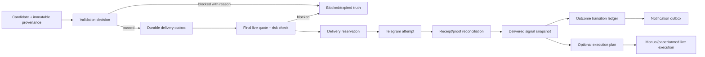

# Phase 2 — Competitive Research and Gap Analysis

Date: 2026-07-14
Repository: `SignalRankAI1`
Canonical baseline: branch `fix-2`, commit `ca616b11043683aaa5a5c01702f292a5a5c42591`
Prior phase: `docs/PHASE1_FULL_CODEBASE_COMPREHENSION_2026-07-14.md`
Change scope: research and documentation only; no runtime, schema, dependency, configuration, or test behavior was changed.
Phase verdict: **Phase 2 complete; proceed to Phase 3 planning, not implementation.**

## 1. Executive conclusion

SignalRankAI should not try to win by becoming a smaller clone of TradingView, 3Commas, CoinStats, or Cornix. Its strongest credible position is a **trust-first, Telegram-native trading decision system** that combines:

- fresh, source-attributed market validation;
- explainable signal and risk decisions;
- fast manual, paper, and eventually consented automated workflows;
- durable delivery and lifecycle proof;
- portfolio-aware exposure controls;
- and honest, provenance-separated performance evidence.

The canonical codebase already contains pieces of nearly all of that product. Its competitive gap is not raw feature count. The gap is that the pieces do not yet form one authoritative, reliable system:

- several modules can own the same provider, lifecycle, tier, payment, outcome, or execution decision;
- delivery is reserved and proved, but ambiguous sends are not durably reconciled and success is not globally monotonic;
- the final quote object is structured, but its market timestamp and source confidence are not trustworthy in every fallback;
- backtest, WFO, shadow, live, paper, and model-governance foundations exist, but do not form one mandatory evidence-to-promotion contract;
- the Railway runtime combines every failure domain in one process;
- payment and public API paths are not production-valid;
- tests and readiness evidence are red.

The highest-value Phase 3 design objective is therefore **authoritative truth paths before new features**. A new feature that enters one of the alternate paths would increase surface area while reducing trust.

No research supports a guaranteed or currently achieved 60% win rate. The codebase must measure performance by provenance, costs, sample size, regime, and out-of-sample evidence before making any public claim.

## 2. Scope, method, and evidence rules

This phase compared the Phase 1 repository evidence against current first-party documentation from:

- TradingView for alert creation, lifecycle, capacity tiers, and webhook delivery;
- 3Commas for signal intake, bot state, automation, risk limits, and managed trade execution;
- CoinStats for portfolio context, alert preferences, usage limits, and API security;
- Cornix as a Telegram-native signal-to-trade reference;
- Telegram's official Bot API and bot product guidance;
- Stripe for idempotent requests and resilient webhook processing;
- Netflix engineering for adaptive concurrency, priority load shedding, message tracing, and failure experiments;
- Meta engineering for mandatory review, layered/autonomous testing, static analysis, canaries, and progressive rollout;
- OpenTelemetry, PostgreSQL, Railway, OWASP, Paystack, and financial backtest-overfitting research for supporting platform standards.

Marketing claims were not used as proof of product quality or profitability. Competitive features are treated as design evidence, not instructions to copy a product. Repository statements come from the canonical checkout and Phase 1 verification, not from old completion reports.

Gap ratings used below:

- **Critical** — blocks a safe paid/public path or can create incorrect financial-adjacent behavior.
- **High** — materially limits reliability, scale, user trust, or evidence quality.
- **Medium** — reduces maintainability, conversion, or operational efficiency but can be sequenced after safety foundations.

## 3. What the reference systems do well

### 3.1 TradingView: alerts are managed resources, not fire-and-forget messages

TradingView exposes alert condition, frequency, expiration, name, message placeholders, and multiple notification actions. Its alert manager shows state and stop reason, supports pause/resume/edit/delete, retains an alert log, and can export history. Capacity is separated by resource type, and higher tiers buy more active alerts and more capable workflows rather than a promise of better returns. Multi-condition alerts and reusable presets reduce setup friction. [Alert setup](https://www.tradingview.com/support/solutions/43000595315-how-to-set-up-alerts/), [alert management](https://www.tradingview.com/support/solutions/43000595311-manage-alerts/), [alert types and limits](https://www.tradingview.com/support/solutions/43000696403-alerts-separation-by-type/), [multi-condition alerts](https://www.tradingview.com/support/solutions/43000761492-multi-condition-alerts/), [presets](https://www.tradingview.com/support/solutions/43000774194-alert-presets/).

Its webhook contract is deliberately constrained: authenticated HTTPS endpoints, no secrets in payloads, a short response budget, a visible webhook delivery status, and 2FA before webhook use. TradingView also warns that webhook delivery can fail. [TradingView webhook guidance](https://www.tradingview.com/support/solutions/43000529348-how-to-configure-webhook-alerts/).

Applicable lessons:

1. Treat every signal/alert as a versioned managed object with an explicit state, reason, expiry, configuration snapshot, and delivery history.
2. Separate notification destinations from the condition that produced the alert.
3. Expose delivery outcome and recovery status to operators and, where useful, users.
4. Tier by capacity, workflow complexity, history, automation, and support—not by unproven profit quality.
5. Snapshot configuration when an alert is armed; later setting changes should not silently mutate an active decision.

### 3.2 3Commas: automation begins with arming, limits, and explicit rejection

3Commas Signal Bots transform accepted external signals into managed trade instructions. Configuration includes exchange/pair, direction, leverage, maximum bot and per-trade investment, maximum active trades, entries, take profit, stop loss, trailing behavior, and an explicit save-versus-start distinction. Invalid or direction-incompatible signals are ignored. [Signal Bot setup](https://help.3commas.io/en/articles/11066386-signal-bot-getting-started), [Signal Bot FAQ](https://help.3commas.io/en/articles/8637909-signal-bot-faq).

The product distinguishes signal intake from the trade-management layer. It offers manual approval paths, manages stop/take-profit behavior, exposes logs, and constrains risk with maximum concurrent trades, per-pair controls, cooldowns, and stop behavior. [DCA bot FAQ](https://help.3commas.io/en/articles/11865862-dca-bot-faq), [stop-loss behavior](https://help.3commas.io/en/articles/3108977-smarttrade-dca-bots-how-stop-loss-works), [take-profit behavior](https://help.3commas.io/en/articles/3108981-how-take-profit-works-smarttrade-and-dca-bots-trailing-feature-explained).

Applicable lessons:

1. A signal is not an order. Use a separate, persisted execution plan and execution state.
2. An automation bot must be explicitly armed and globally allowed; saved user intent alone is insufficient.
3. Validate direction, symbol, exchange mapping, balance, risk budget, concurrent exposure, and protective orders before dispatch.
4. Provide manual approval and dry-run paths before AUTO.
5. Preserve a reasoned audit log for ignored, blocked, submitted, partially filled, protected, closed, and reconciled actions.

### 3.3 CoinStats: signals become more useful in portfolio context

CoinStats focuses on unified holdings, allocation, profit/loss, historical portfolio behavior, transaction flows, portfolio health, watchlists, and configurable alerts. It supports sensitivity levels, custom price/volume/market-cap/portfolio-value alerts, scheduled portfolio summaries, transaction notifications, and read-only exchange connections. [Product overview](https://help.coinstats.app/en/articles/1537032-what-is-coinstats-app), [price notifications](https://help.coinstats.app/en/articles/2332478-price-notifications), [custom alerts](https://help.coinstats.app/en/articles/3573865-how-to-set-up-custom-alerts), [portfolio value notifications](https://help.coinstats.app/en/articles/5335970-portfolio-value-notification/).

Its tiers distinguish transaction volume, portfolios, sync frequency, analytics, exports, and support. When usage exceeds a plan, visible usage and graceful restricted behavior are preferable to silent loss. Its API guidance keeps keys server-side and recommends monitoring unusual use. [Plan limits](https://help.coinstats.app/en/articles/6281348-transaction-and-portfolio-limits-on-coinstats), [API overview](https://coinstats.app/api-docs/), [API authentication](https://coinstats.app/api-docs/authentication/).

Applicable lessons:

1. Rank signals against current portfolio exposure, direction concentration, risk used, and user horizon.
2. Let users control sensitivity, quiet hours, asset/session preferences, and notification frequency.
3. Make plan usage visible and degrade gracefully at limits.
4. Prefer read-only integrations until execution is explicitly enabled and independently authorized.
5. Sell analytics, workflow, sync, history, and support value—not a claim that a paid tier produces guaranteed wins.

### 3.4 Cornix: Telegram-native trading needs a clear signal-to-trade boundary

Cornix distinguishes a theoretical signal from the actual exchange orders created when it is followed. Users can inspect a signal, follow it once, or configure future automatic following. Personal settings can override channel settings for symbols, direction, leverage, entries, take profits, stops, operation hours, simultaneous trades, total concurrent amount, price, and liquidity. [Signal versus trade](https://help.cornix.io/en/articles/5814976-cornix-signals-vs-trades), [follow-button workflow](https://help.cornix.io/en/articles/11399575-the-signal-follow-buttons), [advanced limits](https://help.cornix.io/en/articles/8975701-signals-bot-advanced-settings-advanced-section), [general filters](https://help.cornix.io/en/articles/8975691-signals-bot-advanced-settings-general-section).

Channel signal changes can flow to automatically opened trades while manual/semi-manual trades require a deliberate update. Cornix also exposes channel-linked backtests with initial funds, trade count, profit/loss, win/loss ratio, drawdown, saved configurations, apply/unapply, and a warning that past results do not guarantee future outcomes. [Signal management](https://help.cornix.io/en/articles/5814964-managing-signals), [Signals Bot backtesting](https://help.cornix.io/en/articles/9576302-how-to-use-cornix-s-signals-bot-backtesting-feature).

Applicable lessons:

1. Make “view,” “follow once,” “paper follow,” and “auto-follow future signals” different actions.
2. Show whether an open trade remains linked to later signal edits.
3. Enforce both per-user overrides and channel/system safety ceilings; user settings may be stricter, never weaker than platform safety.
4. Attach liquidity, direction, operation-hour, and total-exposure filters to the execution plan.
5. Allow reversible application of tested configurations, with version and provenance.

### 3.5 Telegram: acknowledge immediately, authorize on the backend, edit in place

Telegram recommends specific commands, scoped command menus, inline keyboards for settings/navigation, and editing an existing keyboard/message for a smoother flow. It explicitly warns that command scopes are presentation only; the backend must still validate commands and authorization. Telegram also monitors whether callback queries are answered. [Telegram bot features](https://core.telegram.org/bots/features).

The Bot API provides update identifiers for duplicate/order handling, a webhook secret-token header, configurable webhook concurrency, retries after non-2xx responses, and webhook status including pending updates and recent errors. These capabilities support a fast ingress/ACK boundary with durable downstream processing. [Telegram Bot API](https://core.telegram.org/bots/api), [webhook guide](https://core.telegram.org/bots/webhooks).

Current Telegram guidance offers Rich Messages for complex structured content but still positions regular messages as the lightweight choice for short flows. Keeping `TELEGRAM_RICH_MESSAGES_ENABLED` off until library/runtime support and canary evidence exist is correct.

One current commercial constraint is mandatory: digital goods and services sold inside Telegram bots or mini apps must use Telegram Stars, even if an external web portal uses another provider. The required flow includes a successful-payment event, charge ID storage, refund/support handling, terms, and payment support. [Telegram digital-goods payments](https://core.telegram.org/bots/payments-stars).

Applicable lessons:

1. ACK callback queries before storage or provider work.
2. Dedupe Telegram updates and make handlers replay-safe.
3. Authenticate webhook ingress with the secret-token header and monitor pending/error state.
4. Prefer editing a live signal card over emitting chat noise, with a safe plain/HTML fallback.
5. Resolve the Telegram Stars versus web/Paystack product boundary before selling subscriptions through the bot.

## 4. Enterprise engineering patterns to adopt

### 4.1 Stripe-style idempotency and webhook processing

Stripe makes mutating requests safely retryable with an idempotency key and rejects incompatible reuse. Its webhook guidance requires raw-body signature verification, fast `2xx` acknowledgement before complex work, tolerance for duplicate delivery and out-of-order events, and retrieval of missing state rather than assuming event order. Delivery status and request IDs support operations. [Idempotent requests](https://docs.stripe.com/api/idempotent_requests), [webhook processing](https://docs.stripe.com/webhooks), [request IDs](https://docs.stripe.com/api/request_ids).

SignalRankAI implications:

- Use operation-scoped idempotency keys for delivery, payment activation, lifecycle transitions, notification, and broker submission.
- Persist an inbox record before acknowledging externally important webhooks; process asynchronously.
- Make success terminal/monotonic unless an explicit compensating transition exists.
- Store provider event IDs, request IDs, body hash, processing attempts, final status, and error classification.
- Do not couple correctness to arrival order.

Paystack's own webhook guidance is compatible: validate `x-paystack-signature` using HMAC-SHA512, acknowledge promptly, and expect retries for non-200 responses. [Paystack webhooks](https://paystack.com/docs/payments/webhooks/).

### 4.2 Netflix-style resilience and event truth

Netflix's adaptive concurrency work uses latency, timeouts, and rejections to detect queue growth, constrain inflight work, reject excess load, and protect dependencies. It distinguishes traffic classes so critical user work can retain capacity while batch/background work is shed or delayed. [Netflix concurrency limits](https://github.com/Netflix/concurrency-limits).

Netflix's priority load-shedding design classifies traffic by criticality, monitors error/concurrency/resource pressure, progressively drops lower-priority work, communicates backoff to clients, and validates classifications with fault injection and controlled experiments. [Prioritized load shedding](https://netflixtechblog.com/keeping-netflix-reliable-using-prioritized-load-shedding-6cc827b02f94).

Its streaming trace system gives messages unique IDs and measures loss, duplication, and latency across send/receive points. Delivery guarantees are treated as something to measure, not assume. [Inca message tracing](https://netflixtechblog.medium.com/inca-message-tracing-and-loss-detection-for-streaming-data-netflix-de4836fc38c9).

SignalRankAI implications:

- Reserve capacity for callback ACKs, user commands, payment proof, delivery proof, and broker safety actions.
- Apply bounded concurrency, deadlines, backoff with jitter, circuit state, and load shedding to providers and background jobs.
- Never let analytics, shadow tracking, or batch scans exhaust interactive or critical work.
- Trace a signal/event ID across candidate, validation, queue, delivery, lifecycle, notification, and optional execution.
- Continuously measure lost, duplicate, late, and recovered events.
- Test provider failure, Redis loss, DB pressure, Telegram ambiguity, and retry storms deliberately before launch.

### 4.3 Meta-style code quality and safe change delivery

Meta describes review as mandatory for every diff and balances speed metrics with quality guardrails. Its testing work combines fast domain tests, integration contracts, autonomous/fuzz-like service testing, UI-level fault discovery, and static analysis. [Code review](https://engineering.fb.com/2022/11/16/culture/meta-code-review-time-improving/), [autonomous service testing](https://engineering.fb.com/2021/10/20/developer-tools/autonomous-testing/), [Sapienz](https://engineering.fb.com/2018/05/02/developer-tools/sapienz-intelligent-automated-software-testing-at-scale/), [Infer/SapFix workflow](https://engineering.fb.com/2018/09/13/developer-tools/finding-and-fixing-software-bugs-automatically-with-sapfix-and-sapienz/).

Meta's safe configuration work emphasizes canaries, progressive rollout, health signals, regression detection, and low-blame incident learning. Its staged certificate rollout validates a small canary, widens exposure, bakes, then deploys fleet-wide. [Configuration safety](https://engineering.fb.com/2026/04/08/security/trust-but-canary-configuration-safety-at-scale-meta-tech-podcast/), [staged security rollout](https://engineering.fb.com/2023/08/07/security/short-lived-certificates-protect-tls-secrets/).

SignalRankAI implications:

- Require review and passing gates for production changes, especially safety defaults and migrations.
- Keep most tests at fast domain boundaries; add a smaller number of contract and end-to-end success/failure paths.
- Add property/state-machine tests for lifecycle monotonicity, idempotency, risk sizing, and replay.
- Canary rich messages, provider-order changes, model candidates, thresholds, migrations, and execution features.
- Separate deploy from activation through default-off feature flags and progressive exposure.
- Measure a goal metric and a guardrail metric for every optimization; faster delivery must not increase stale or duplicate delivery.

### 4.4 Supporting platform standards

- OpenTelemetry correlates traces, metrics, and logs through propagated context. SignalRankAI needs a single correlation chain across its future service roles, not isolated log statements. [OpenTelemetry signals](https://opentelemetry.io/docs/concepts/signals/), [context propagation](https://opentelemetry.io/docs/concepts/context-propagation/).
- PostgreSQL documents `CREATE INDEX CONCURRENTLY` as the way to build an index without blocking writes. Active production tables must not receive ordinary startup index builds. [PostgreSQL `CREATE INDEX`](https://www.postgresql.org/docs/current/sql-createindex.html).
- Railway health checks gate deployment traffic only when an endpoint returns `200` and are not continuous monitoring. The endpoint must therefore mean “ready,” and separate uptime/SLO monitoring is still needed. Railway also supports independent replicas per service, which only helps after stateful roles and local fallbacks are removed. [Railway health checks](https://docs.railway.com/deployments/healthchecks), [Railway scaling](https://docs.railway.com/deployments/scaling).
- OWASP's API Security Top 10 emphasizes object/function authorization, resource consumption, sensitive business flows, and unsafe third-party API consumption—all directly relevant to token management, admin actions, payment hooks, broker links, and provider adapters. [OWASP API Security 2023](https://owasp.org/API-Security/editions/2023/en/0x04-release-notes/).

## 5. Repository-specific gap matrix

| Dimension | Rating | Existing foundation to preserve | Material gap against research | Required direction for Phase 3 |
|---|---|---|---|---|
| Scalability | **High** | Dedicated modes exist; Redis and DB priority concepts exist | Normal Railway path runs web, bot, engine, workers, scheduler, and webhook consumers in one process; tiny DB pool and process-local fallbacks prevent safe horizontal scaling | Define independently deployable roles, durable queues, ownership, concurrency budgets, and scale-safe leader/scheduler semantics |
| Performance | **High** | Callback ACK, command timeouts, interactive DB priority, caching, provider instrumentation | God modules, synchronous production pipeline, per-signal outcome price fetches, 64 webhook workers against a tiny pool, and background/analytics competition create tail-latency risk | Set latency budgets and priority admission; batch by asset; bound every queue/dependency; shed analytics first; measure p50/p95/p99 |
| Real-time delivery | **Critical** | Delivery reservation, message-ID proof, final validation, active-message tracking, retry wrappers | No durable receipt stash/reconciliation after accepted-send/DB-failure ambiguity; idempotency lacks channel scope; late failure can overwrite success; ingress fallback weakens cross-process guarantees | Design a durable inbox/outbox/receipt state machine with monotonic transitions, per-user/signal/channel keys, reconciliation, replay tests, and delivery SLOs |
| Market-data reliability | **Critical** | Structured `LivePriceQuote`, provider fallbacks/health, asset mapping, stale and drift checks | Fetch time can substitute for market time; previous-close and untimestamped DB fallback can appear fresh; confidence is not evidence-derived; provider ownership and market-hours rules are fragmented | One typed quote contract with source timestamp, receive timestamp, age, session, sequence, confidence reason, provenance, and asset-class fail-closed policy |
| Signal quality | **High** | Consensus, risk, ML, scoring, profile, quality, exposure, and expectancy gates | Fallback generation defaults on; some gates fail open; production and alternate strategy stacks diverge; prompt/model/feature/provider provenance is incomplete | Define one candidate manifest and decision record; make “no trade” first-class; version strategy/features/model/prompt/data; promote only through evidence gates |
| Backtesting and WFO | **Critical** | Backtest/WFO utilities, calibration, shadow predictions, statistics, quarantine/promotion fragments | No one mandatory, reproducible promotion contract; limited cost/latency/missed-entry provenance; results are not uniformly separated from live/paper/shadow; multiple-testing risk is not controlled | Define purged time splits/WFO, realistic fills/costs, segment sample minimums, immutable run manifests, champion/challenger, rollback, PBO/selection-bias controls, and no public claim without methodology |
| Outcome tracking | **Critical** | Realtime and shadow trackers, progression/idempotency helpers, lifecycle events, active messages | Multiple scanners and lifecycle vocabularies; detection and notification overlap; no required Redis snapshot; no one-price-per-asset cycle; delivery-state strings disagree | One authoritative lifecycle graph, append-only transition ledger, snapshot projection, batched asset quotes, monotonic compare-and-set, and separate notification outbox |
| User experience | **High** | Broad command surface, profiles, tier formatting, fast ACK foundation, active-message updates, safe rich-message flag | Duplicate handler ownership, inconsistent buttons/states, storage work on interaction paths, limited block/recovery explanations, and fragmented setup flows | Build a small task-oriented interaction model: inspect, follow, paper follow, monitor, update, close; edit in place; expose reason/status/freshness; keep fallback messages |
| Tiering and conversion | **High** | Free/Premium/VIP concepts, tier-aware formatting, asset/profile filtering, pricing commands | Policy is spread across modules; comments/defaults conflict; value is not consistently tied to workflow/capacity; upgrade intent and limit usage are not one funnel | Central policy for entitlements, quotas, latency class, history, analytics, automation eligibility, support, and explainable lock reasons; never imply guaranteed returns |
| Payments/subscriptions | **Critical** | Paystack verification/HMAC fragments, processed-event/payment models, unique references, subscription metadata | Three implementations; production router unmounted/broken; activation contracts disagree; default enablement is unsafe; no coherent signature→verification→activation transaction; Telegram Stars constraint unresolved | Choose web/Telegram commerce boundary; implement signed durable inbox, provider verification, amount/currency/tier/user validation, idempotent activation/refund/expiry ledger, and default-off launch |
| Security/privacy | **Critical** | Token hash storage/revoke/expiry, Fernet credential encryption, admin audit foundations, privacy/timezone controls | Numeric-ID dashboard login, default secrets/pepper, unauthenticated alternate token management, chat credential exposure, inconsistent ingress authentication, and no atomic global AUTO gate | Threat-model identities and trust boundaries; authenticated web sessions/RBAC; secret rotation/redaction; webhook secrets/signatures; rate limits; disable sensitive chat capture; atomic execution safety checks |
| API design | **Critical** | A FastAPI signal/token API and repository token primitives exist | API is unmounted; production web composition is invalid; auth contracts are unsafe/missing; no stable versioned schemas, error model, idempotency contract, or pagination/quotas across paths | Define one versioned public/admin API surface with object/function authorization, scopes, request IDs, idempotency, validation, consistent errors, rate/resource limits, and audit |
| DevOps/deployment | **Critical** | Railway configs, dedicated run modes, migrations, readiness script, feature flags | `RUN_MODE`/`MODE` drift; competing starts; monolith; liveness passes broken dependencies; three migration trees plus runtime DDL; dependencies not locked | Define a deploy matrix per role, one start contract, readiness/dependency checks, one migration chain, concurrent/nonblocking migration rules, pinned builds, canary and rollback procedure |
| Observability | **High** | Metrics and optional Sentry/OTel foundations, provider/delivery logs, admin pulse | Metrics are not exposed in production; logs lack universal correlation; no end-to-end event trace, SLOs, queue-age panels, or actionable readiness | Propagate signal/event/request IDs; expose metrics; correlate logs/traces; define SLOs for ACK, delivery, freshness, outcome lag, payments, and execution; alert on symptoms and backlog |
| Testing | **Critical** | More than 400 tests, focused regression tests, production readiness script | Collection fails; 31 remaining failures and 2 errors; Flask/ASGI defect is reproduced; architecture smoke is missing; environment portability issues remain; failure/replay properties are not systemically tested | Restore a green deterministic gate; layer unit/contract/integration/E2E tests; add replay, state-machine, property, load, migration, security, provider-failure, and chaos scenarios |
| Code quality | **High** | Partial decompositions, typed quote/prompt foundations, governance docs | Five very large god modules, shadowed imports, duplicate function definitions/handlers, alternate active-looking stacks, runtime DDL, repository clutter, and import/registration-order behavior | Establish ownership boundaries and compatibility facades; remove duplicate authority incrementally; static analysis/type/format gates; dependency lock; architecture tests; living concise ADR/context |

## 6. Cross-cutting product decisions

### 6.1 The differentiated product promise

Recommended promise:

> SignalRankAI helps traders decide and act with current market evidence, explicit risk, and a verifiable outcome record.

Do not promise:

- guaranteed profit;
- a paid-tier-only “better win rate” without controlled evidence;
- real-time delivery when the source quote or provider timestamp is not trustworthy;
- automated execution before the arming, risk, consent, broker, and global launch gates are all true.

### 6.2 Tier hypothesis to validate

| Tier | Honest user value | Safety boundary |
|---|---|---|
| Free | Education, limited/delayed evidence, selected signals, basic outcomes and watchlist | No live automation; transparent limits and timestamps |
| Premium | Timely qualified signals, profiles, active lifecycle updates, paper workflow, deeper history/analytics, custom alerts | Manual/paper by default; execution only after later audited eligibility |
| VIP | Priority delivery class, advanced portfolio/exposure intelligence, strategy provenance, execution-grade preflight, higher limits/support | Does not bypass freshness, risk, provider trust, consent, or global kill switches |
| Admin/Owner | Operations, provider/queue/DB/payment/model controls and audited interventions | Strong RBAC, MFA where available, immutable audit; never a user entitlement shortcut |

The tier contract should be centralized and enforced server-side. UI copy should explain both the unlocked value and why a safety block cannot be purchased away.

### 6.3 One signal truth chain

Phase 3 should design one authoritative chain, regardless of later physical service boundaries:

Every transition needs an event/operation ID, predecessor state, timestamps, actor/source, reason, attempts, and an idempotency rule. Read models and Redis snapshots can accelerate interaction but must not become an untraceable alternative source of truth.

### 6.4 Honest performance and promotion policy

Cornix exposes trade count and drawdown alongside profit/loss and warns that past results do not guarantee future outcomes. Academic research further shows that ordinary holdout techniques can be unreliable in investment backtests and that selecting among many trials inflates apparent performance. [Probability of Backtest Overfitting](https://papers.ssrn.com/sol3/papers.cfm?abstract_id=2326253), [Deflated Sharpe Ratio](https://papers.ssrn.com/sol3/papers.cfm?abstract_id=2460551).

SignalRankAI should require, at minimum:

- immutable dataset/provider/time-range/strategy/parameter/model/prompt manifests;
- train/validation/test/live temporal separation and rolling WFO;
- spread, fees, slippage, latency, entry-touch, partial fill, missed entry, expiry, and market-hours assumptions;
- backtest, shadow, paper, manual, copy, and live results stored separately;
- win rate, TP-level hit rates, stop rate, missed/expired rate, average R, expectancy, profit factor, drawdown, sample size, uncertainty, and trial count;
- per-asset, timeframe, strategy, session, profile, and regime reporting;
- minimum sample and stability gates before promotion;
- champion/challenger shadowing and automatic rollback/quarantine;
- public results labeled with period, provenance, sample, costs, methodology, and last update.

Win rate alone is not a promotion metric. A high win rate with negative expectancy or unacceptable drawdown must fail.

## 7. Ranked gaps for the next phase to plan

This is prioritization input, not the Phase 3 implementation plan.

### Priority 0 — contain unsafe external effects

1. Keep public payments, AUTO, copy trading, rich messages, and public broker/API linkage disabled.
2. Require one atomic global execution gate in addition to user consent, tier, risk, and broker checks.
3. Define canonical payment and API trust boundaries, including Telegram Stars versus web checkout.
4. Remove false health: broken web composition, missing readiness, and unsafe migration behavior block all public launch paths.

### Priority 1 — create authoritative delivery and market truth

1. One provider/quote contract with verifiable market timestamps and confidence reasons.
2. One durable signal/delivery lifecycle with inbox, outbox, receipt, monotonic status, and reconciliation.
3. One outcome lifecycle and snapshot projection with batched quotes and independent notification delivery.
4. End-to-end signal/event correlation and delivery/freshness/outcome SLOs.

### Priority 2 — isolate workloads and prove failure behavior

1. Service-role ownership and durable cross-role queues.
2. DB priority classes and per-role connection/concurrency budgets.
3. Backpressure, dependency timeouts, circuit policy, and progressive load shedding.
4. Green deterministic CI plus replay, load, migration, provider-failure, and chaos verification.

### Priority 3 — consolidate product policy and evidence

1. One tier/entitlement/limit policy and upgrade funnel.
2. One strategy/model promotion and performance-truth contract.
3. Portfolio/exposure context and user notification preferences.
4. Incremental god-module decomposition behind compatibility facades.

## 8. Phase 3 entry criteria and open decisions

Phase 3 may now begin against the canonical commit. It must produce the requested file-by-file and subsystem-by-subsystem master plan before code changes.

The plan must explicitly resolve:

1. Which database records and event ledgers are authoritative for signal, delivery, lifecycle, payment, and execution.
2. Which process owns each transition and which transitions are allowed.
3. Queue technology, retry/dead-letter/reconciliation rules, and behavior when Redis is unavailable.
4. Asset-class quote providers, source timestamp contract, confidence model, and fail-closed thresholds.
5. Railway role topology, connection budgets, readiness, scheduler leadership, scaling, and deployment order.
6. One active web/API framework and route composition.
7. Telegram Stars versus external Paystack purchase journeys and subscription reconciliation.
8. Backtest/WFO promotion thresholds, sample policy, multiple-testing controls, and public disclosure rules.
9. Exact default-off activation and canary rules for payments, API, rich messages, copy, and AUTO.
10. Compatibility/facade boundaries that preserve working behavior during decomposition.

## 9. Verification and phase gate

No implementation occurred in Phase 2, so runtime tests were not rerun as evidence of a code change. The inherited canonical-baseline results remain:

- exact pytest collection: failed on missing `web.app.verify_api_key`;
- all otherwise collectable test files: **406 passed, 31 failed, 2 errors**;
- source compile excluding virtual environments: passed;
- architecture smoke: missing;
- production readiness: failed `web_health_routes`;
- configured Alembic heads: one head, `0019_user_timezone_privacy`.

Documentation verification completed:

- both phase reports exist and are readable as UTF-8;
- trailing-whitespace checks passed for both reports;
- fenced code blocks are balanced in both reports;
- the Phase 2 report contains every requested gap-matrix dimension and 49 distinct primary-source links;
- `git diff --no-index --check` reported no whitespace findings for either untracked report;
- the recorded checkout still equals `ca616b11043683aaa5a5c01702f292a5a5c42591`;
- `git status --short` lists only the two new documentation files, so no runtime file changed.

Final Phase 2 gate:

- Canonical replacement baseline: **accepted**
- Competitive and enterprise research: **complete**
- Repository-specific gap analysis: **complete**
- Runtime implementation: **not started**
- Public production readiness: **No**
- Limited paid beta readiness: **No**
- Permitted next action: **Phase 3 master optimization plan**

## 10. Primary source index

### Products and Telegram

- [TradingView alert setup](https://www.tradingview.com/support/solutions/43000595315-how-to-set-up-alerts/)
- [TradingView webhook guidance](https://www.tradingview.com/support/solutions/43000529348-how-to-configure-webhook-alerts/)
- [TradingView alert management](https://www.tradingview.com/support/solutions/43000595311-manage-alerts/)
- [3Commas Signal Bot setup](https://help.3commas.io/en/articles/11066386-signal-bot-getting-started)
- [3Commas Signal Bot FAQ](https://help.3commas.io/en/articles/8637909-signal-bot-faq)
- [CoinStats product overview](https://help.coinstats.app/en/articles/1537032-what-is-coinstats-app)
- [CoinStats plan limits](https://help.coinstats.app/en/articles/6281348-transaction-and-portfolio-limits-on-coinstats)
- [Cornix signal versus trade](https://help.cornix.io/en/articles/5814976-cornix-signals-vs-trades)
- [Cornix advanced signal-bot limits](https://help.cornix.io/en/articles/8975701-signals-bot-advanced-settings-advanced-section)
- [Cornix backtesting](https://help.cornix.io/en/articles/9576302-how-to-use-cornix-s-signals-bot-backtesting-feature)
- [Telegram Bot API](https://core.telegram.org/bots/api)
- [Telegram bot features](https://core.telegram.org/bots/features)
- [Telegram digital-goods payments](https://core.telegram.org/bots/payments-stars)

### Engineering and platform

- [Stripe idempotent requests](https://docs.stripe.com/api/idempotent_requests)
- [Stripe webhook processing](https://docs.stripe.com/webhooks)
- [Paystack webhooks](https://paystack.com/docs/payments/webhooks/)
- [Netflix adaptive concurrency limits](https://github.com/Netflix/concurrency-limits)
- [Netflix prioritized load shedding](https://netflixtechblog.com/keeping-netflix-reliable-using-prioritized-load-shedding-6cc827b02f94)
- [Netflix message tracing](https://netflixtechblog.medium.com/inca-message-tracing-and-loss-detection-for-streaming-data-netflix-de4836fc38c9)
- [Meta code review](https://engineering.fb.com/2022/11/16/culture/meta-code-review-time-improving/)
- [Meta autonomous service testing](https://engineering.fb.com/2021/10/20/developer-tools/autonomous-testing/)
- [Meta configuration canaries](https://engineering.fb.com/2026/04/08/security/trust-but-canary-configuration-safety-at-scale-meta-tech-podcast/)
- [OpenTelemetry signals](https://opentelemetry.io/docs/concepts/signals/)
- [PostgreSQL concurrent indexes](https://www.postgresql.org/docs/current/sql-createindex.html)
- [Railway health checks](https://docs.railway.com/deployments/healthchecks)
- [Railway scaling](https://docs.railway.com/deployments/scaling)
- [OWASP API Security Top 10 2023](https://owasp.org/API-Security/editions/2023/en/0x04-release-notes/)
- [Probability of Backtest Overfitting](https://papers.ssrn.com/sol3/papers.cfm?abstract_id=2326253)
- [Deflated Sharpe Ratio](https://papers.ssrn.com/sol3/papers.cfm?abstract_id=2460551)
