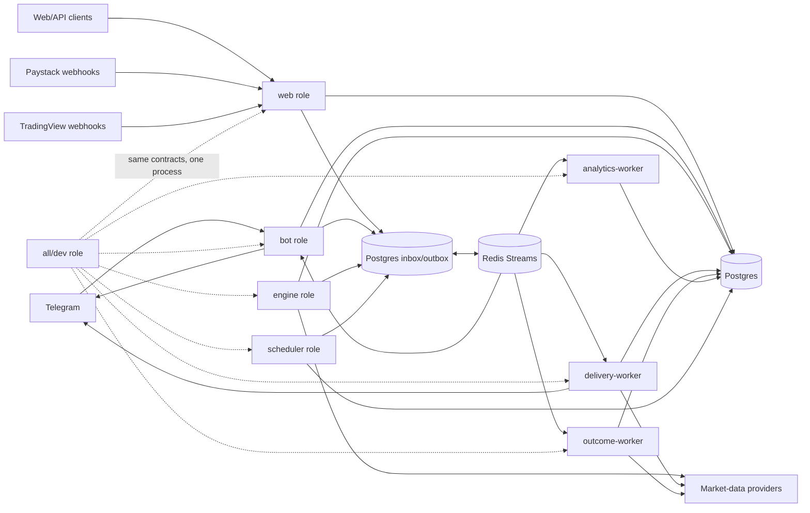
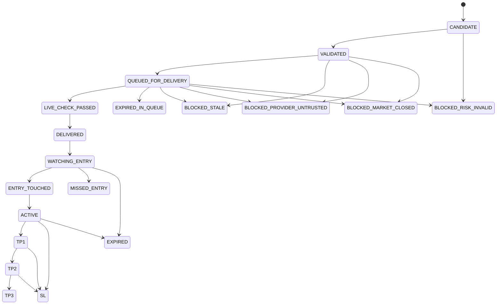

# Phase 3 — Master Optimization Plan

Date: 2026-07-14
Repository: `SignalRankAI1`
Canonical baseline: branch `fix-2`, commit `ca616b11043683aaa5a5c01702f292a5a5c42591`
Inputs: `docs/PHASE1_FULL_CODEBASE_COMPREHENSION_2026-07-14.md` and `docs/PHASE2_COMPETITIVE_RESEARCH_AND_GAP_ANALYSIS_2026-07-14.md`
Change scope: planning and documentation only; no runtime, schema, dependency, configuration, or test behavior was changed.
Phase verdict: **Phase 3 complete when this plan is approved; implementation begins with Phase 4 Pass 1 only.**

## 1. Outcome and planning stance

This plan converts the canonical repository audit and competitive research into an ordered implementation program. It does not authorize a rewrite, unsafe feature activation, or public launch.

The organizing principle is **one authoritative path per consequential decision**:

- one runtime role owns each workload;
- one provider contract determines whether a quote is deliverable;
- one state machine governs signal lifecycle;
- one delivery ledger governs reservation, send proof, ambiguity, and repair;
- one payment ledger governs subscription entitlement;
- one execution plan governs manual, paper, copy, and live actions;
- one performance-truth system governs strategy/model promotion.

The current code already contains important behavior that must survive. The implementation strategy is therefore expand → route through compatibility facades → compare behavior → switch ownership → remove duplicate authority. Large modules are not deleted or rewritten wholesale.

## 2. Non-negotiable preservation and safety constraints

### 2.1 Working behavior to preserve with regression tests

- Delivery reservation before Telegram send.
- Telegram chat/message ID proof for confirmed delivery.
- Interactive and critical DB priority concepts.
- Background DB admission limits and defer/drop behavior.
- Signal age, queue age, entry drift, consumed TP/SL, and risk/reward delivery checks.
- Asset, profile, tier, and exposure filtering.
- Fast callback acknowledgement and command timeout handling.
- Telegram retry and flood-control wrappers.
- Regular HTML/plain delivery fallback.
- Rich Messages disabled by default.
- Structured live quote and prompt-registry foundations.
- Provider fallback and health instrumentation.
- Outcome progression/idempotency guards already present.
- User timezone/privacy behavior.
- Hash-only API token storage, expiry, scope, and revocation foundations.
- Fail-closed Fernet credential encryption.
- Existing AUTO-path user opt-in, hard stop, slippage, limits, drawdown, reconciliation, and kill-switch behavior.
- Backtest/WFO, shadow, calibration, drift, model registry, strategy statistics, and honest evidence utilities.

### 2.2 Feature activation policy through Phase 4

These settings remain off in every default, example, test production profile, and deployed environment until their owning pass and Pass 10 soak gate succeed:

- `AUTO_TRADE_ENABLED=0`
- `COPY_TRADE_ENABLED=0`
- `PAYMENTS_ENABLED=0` for public users
- `TELEGRAM_RICH_MESSAGES_ENABLED=0`
- `VIP_WEBHOOK_DISPATCH_ENABLED=0`
- chat-based MT5 credential capture disabled unless explicitly allowed for an internal test account

No paid tier may bypass freshness, provider trust, market-hours, risk, consent, kill-switch, or evidence rules.

### 2.3 Change rules for every implementation pass

Each pass must:

1. inspect and record current behavior before editing;
2. introduce a compatibility boundary before moving ownership;
3. add success, failure, retry, replay, and regression tests proportional to risk;
4. compile changed modules and run targeted tests;
5. run the full test suite before closing the pass;
6. record changed files, configuration changes, migration behavior, rollback, and runtime verification;
7. keep unsafe features off unless the pass explicitly reaches its canary gate;
8. stop if canonical behavior cannot be reproduced or a migration cannot be proven safe.

## 3. Target architecture and service ownership

### 3.1 Production topology



PostgreSQL is the durable authority. Redis Streams carries work and provides fast projections, locks, rate limits, and snapshots. A production Redis outage must not silently switch to process-local correctness: producers retain a transactional Postgres outbox, relays resume later, and consumers do not acknowledge work until the authoritative transaction commits. In-memory fallback is limited to `all/dev` and clearly marked non-production.

### 3.2 Role contract

| Role | Owns | Must not own | Scaling and readiness |
|---|---|---|---|
| `web` | FastAPI website/dashboard, `/api/v1`, Paystack ingress, TradingView ingress, public auth, liveness/readiness | Engine loops, Telegram dispatch, outcome scans, scheduler jobs, migrations | Horizontally scalable; ready only after route/auth/config/DB checks |
| `bot` | Telegram webhook authentication, durable update inbox, PTB command/callback processing, immediate ACK, interaction reads/writes | Candidate generation, bulk delivery fanout, outcome detection, payment activation logic | Scalable by partition/consumer group; duplicate updates replay-safe |
| `engine` | Asset scheduling input, market analysis, strategy execution, candidate provenance, validation up to queued delivery | Telegram send, outcome notification, payment, web serving | One or more workers with per-asset leases; ready after DB/Redis/provider config |
| `delivery-worker` | Eligibility, final fresh quote, final risk/market checks, reservation, send/update, receipt stash, proof reconciliation | Candidate generation, outcome detection, subscription mutation | Horizontally scalable by consumer group; user/signal/channel idempotency |
| `outcome-worker` | Batched active-signal scans, one quote per asset/cycle, lifecycle CAS, outcome ledger, Redis snapshot, notification outbox | Direct user interaction and analytics training | Horizontally scalable by asset shard; monotonic transitions |
| `analytics-worker` | Shadow outcomes, WFO/backtest jobs, model evaluation, rollups, reports, drift analysis | Interactive DB capacity, live delivery/execution mutation | Lowest priority; safely deferred or shed under pressure |
| `scheduler` | Singleton due-job calculation and durable event publication | Heavy job execution, direct Telegram delivery | Advisory-lock/lease with fencing; replacement replica can take over |
| `all/dev` | All roles using the same public interfaces and event envelopes | Production deployment | Local-only convenience; explicit warning and no claim of scale evidence |

### 3.3 Runtime files to introduce

- `runtime/roles.py`: strict `RUN_MODE` enum, role configuration, production validation, and shared shutdown contract.
- `runtime/web.py`, `runtime/bot.py`, `runtime/engine.py`, `runtime/delivery.py`, `runtime/outcome.py`, `runtime/analytics.py`, `runtime/scheduler.py`: one start/stop function per role.
- `runtime/all_dev.py`: composes roles for local development without changing their interfaces.
- `runtime/health.py`: `/livez`, `/readyz`, build/version metadata, dependency checks, and worker heartbeat support.
- `core/events.py`: versioned event envelope and correlation fields.
- `services/event_bus.py`: Redis Streams producer/consumer interface with consumer groups and bounded claim/retry.
- `services/outbox.py`: transactional Postgres outbox relay and inbox deduplication.

`main.py` becomes the only process dispatcher. `railway_main.py` remains temporarily as a compatibility entrypoint and then delegates to the canonical web or `all/dev` app; it no longer owns every subsystem.

## 4. Authoritative data and event contracts

### 4.1 Event envelope

Every cross-role event uses a versioned envelope:

| Field | Rule |
|---|---|
| `event_id` | UUID; globally unique and the inbox dedupe key |
| `event_type` | Stable dotted name such as `signal.delivery.requested.v1` |
| `schema_version` | Positive integer; consumers reject unsupported breaking versions |
| `aggregate_type`, `aggregate_id` | Signal, delivery, payment, execution, or user identity |
| `correlation_id` | Signal ID for signal flows; request/payment ID otherwise |
| `causation_id` | Event/operation that caused this event |
| `idempotency_key` | Stable business-operation key, not a retry-attempt ID |
| `occurred_at`, `published_at` | UTC-aware timestamps |
| `producer`, `trace_id` | Role/build and observability context |
| `attempt`, `not_before` | Retry and delayed-delivery control |
| `payload` | Validated schema; no secrets or raw credentials |

Consumer behavior is at-least-once with idempotent effects. A consumer commits the authoritative DB mutation and inbox record in one transaction, then acknowledges the Redis entry. Poison events move to a dead-letter stream with redacted error metadata and an operator replay command.

### 4.2 Sources of truth

| Domain | Durable authority | Fast/read projection | Forbidden competing authority |
|---|---|---|---|
| Signal definition/provenance | `signals` plus immutable decision/provenance record | Cached signal card | In-memory candidate dictionaries after persistence |
| Lifecycle | append-only transition table plus versioned current projection | Redis outcome snapshot | Redis-only TP progress or alternate lifecycle enums |
| Delivery | `signal_deliveries` and receipt/reconciliation records | Redis delivery receipt/snapshot | process-local cooldown or message cache as proof |
| Payment/entitlement | payment event ledger + subscription entitlement transaction | tier cache | callback query, amount matching, or Telegram message alone |
| Execution | execution plan/attempt/fill ledger | broker-position cache | user setting alone or Redis-only idempotency |
| Model/strategy promotion | evaluation run + immutable manifest + approved deployment | active registry cache | file timestamp, best backtest, or dynamic threshold alone |

## 5. State machines and invariants

### 5.1 Canonical signal lifecycle

Required states are stored exactly as uppercase values:



Additional invariants:

- `TP1`, `TP2`, and `TP3` never move backward.
- `SL` after a partial TP is terminal lifecycle state `SL` with outcome metadata such as `partial_win` and the highest TP reached.
- `MISSED_ENTRY` means entry was never touched before its deadline.
- `EXPIRED_IN_QUEUE` is pre-delivery; `EXPIRED` is post-delivery unresolved expiry.
- Blocked states are terminal for that signal version. Rebuilding creates a new signal/version and provenance link; it does not mutate the blocked signal into a fresh one.
- Every transition supplies expected prior version and uses compare-and-set. Duplicate transition keys return the existing result.
- Notification is an outbox effect of a committed transition, never part of detection.

### 5.2 Delivery state machine

`RESERVED → VALIDATING → SENDING → SENT → PROOF_PENDING → CONFIRMED` is the success path. `BLOCKED`, `FAILED_PRE_SEND`, and `AMBIGUOUS` capture distinct failures. `RECONCILED` resolves a proof-pending receipt. A confirmed/reconciled success cannot be overwritten by a later failure.

The idempotency key is `sha256(user_id | signal_id | channel_id | signal_version | delivery_kind)`. Telegram timeout after request transmission becomes `AMBIGUOUS`; it is not blindly retried. A confirmed Bot API response is stashed immediately in Redis and persisted as critical DB work. If DB proof fails, reconciliation consumes the stashed receipt. Plain/HTML fallback produces the same receipt contract as rich delivery.

### 5.3 Payment state machine

`RECEIVED → SIGNATURE_VERIFIED → PROVIDER_VERIFIED → VALIDATED → APPLIED` is the entitlement path. Failures are `REJECTED_SIGNATURE`, `REJECTED_REFERENCE`, `REJECTED_AMOUNT`, `REJECTED_CURRENCY`, `REJECTED_PRODUCT`, or `FAILED_RETRYABLE`. Refund, chargeback, expiry, renewal, and cancellation are compensating events, not row deletion.

Provider event ID/reference is unique. Subscription mutation and processed-event state commit together. Paystack is used for the external website journey; Telegram Stars is used for digital subscriptions purchased inside Telegram. Both map into the same internal product/entitlement catalog.

### 5.4 Execution state machine

Signals do not directly place orders. They can create an immutable execution plan:

`DRAFT → PREFLIGHT_PASSED → AWAITING_CONFIRMATION → ARMED → SUBMITTING → ACKNOWLEDGED → PARTIALLY_FILLED/FILLED → PROTECTED → CLOSED`.

`BLOCKED`, `REJECTED`, `AMBIGUOUS`, `CANCELLED`, and `KILLED` are explicit. Immediately before broker submission, one transaction/atomic guard checks global feature flag, kill switch, user consent, tier entitlement, execution mode, account readiness, quote/slippage, stop, position size, open-trade cap, total exposure, daily loss, and idempotency. Redis outage cannot fail open. Broker-native stop protection is mandatory for live orders.

## 6. DB priority and connection plan

### 6.1 Four priority classes

| Class | Examples | Admission and failure behavior |
|---|---|---|
| `interactive` | callback/profile/signals/settings reads, command response | Reserved foreground capacity; 750 ms acquisition target; cached/degraded user response on timeout; never wait behind analytics |
| `critical` | signal persist, delivery reservation/proof, lifecycle CAS, payment application, execution audit | Reserved capacity; bounded 5 s direct attempt; durable outbox/receipt retry instead of dropping; never silently fail open |
| `background` | outcome scans, maintenance, notification dispatch, provider rollups | Bounded queue and concurrency; 2 s acquisition target; retry with jitter; no foreground reservation consumption while foreground waits |
| `analytics` | WFO, reports, shadow scans, retraining, historical rollups | Zero reserved slots; nonblocking/defer under pressure; separate role/pool budget; cancellable and resumable |

On a two-connection role budget, one slot is reserved for interactive and one for critical work; background borrows only when both classes are idle and analytics is disabled/deferred. Larger budgets use explicit per-role limits rather than multiplying the same pool in hidden event loops. Each connection sets `application_name=signalrankai/<role>`.

`get_session(priority=DBPriority.INTERACTIVE)` replaces the three booleans after a compatibility period. Invalid combinations become impossible. Metrics expose waiting, active, timeout, dropped/deferred, and transaction duration by class/role.

### 6.2 Live migration safety

1. `db/migrations` remains the only configured Alembic tree.
2. A read-only `scripts/schema_audit.py` compares live schema, model metadata, all three existing migration trees, constraints, and invalid indexes.
3. A canonical reconciliation migration follows active head `0019_user_timezone_privacy`; alternate migrations are ported deliberately, not copied blindly.
4. Schema changes use expand → backfill in bounded batches → verify → switch reads/writes → contract in a later release.
5. Indexes on active tables use `CREATE INDEX CONCURRENTLY`/`DROP INDEX CONCURRENTLY` in Alembic autocommit blocks. Concurrent unique-index creation precedes attaching a constraint where needed.
6. No ordinary index build or open-ended DDL runs at application startup.
7. Locking changes to `signals`, `signal_deliveries`, `active_signal_messages`, `outcomes`, `users`, `subscriptions`, or `payments` require a controlled drained maintenance step or a proven online equivalent. They are never opportunistically run during traffic.
8. Migrations set short `lock_timeout`, bounded `statement_timeout`, log progress, and fail the release rather than “warn and continue.”
9. CI upgrades a blank database and a fixture representing `0019`, then downgrades only revisions explicitly declared reversible.
10. `db/auto_ops.py` becomes a read-only schema readiness/audit compatibility facade and is eventually removed from startup.

Planned active revisions, named after audit rather than reusing unverified alternate files:

- `0020_canonical_schema_reconciliation`
- `0021_event_outbox_inbox_and_delivery_receipts`
- `0022_lifecycle_and_outcome_truth`
- `0023_payment_execution_and_provenance_ledgers`
- `0024_performance_truth_and_model_provenance`
- `0025_concurrent_production_indexes`

Exact revision contents are finalized in the owning implementation pass after schema audit; the names do not authorize speculative DDL.

## 7. Final signal validation contract

### 7.1 Quote contract

`LivePriceQuote` becomes a typed provider result with:

- canonical symbol, provider symbol, asset class, bid, ask, last/mid price;
- provider/source timestamp and local received/completed timestamps;
- source age, request latency, session/market status;
- provider health state, breaker state, confidence score and confidence reasons;
- quote kind (`trade`, `bid_ask`, `ticker`, `previous_close`, `db_tick`);
- provenance/request ID and optional cross-provider deviation;
- explicit stale/untrusted reason.

Previous close is analysis-only and never passes a final live delivery check. A DB tick without a source timestamp never passes. `fetched_at` cannot substitute for market time. Provider adapters return typed failure reasons rather than `None`.

### 7.2 Final-send sequence

1. Consume queued delivery and verify signal version/state.
2. Check queue age/Time-to-Telegraph.
3. Reserve user/signal/channel delivery.
4. Fetch a fresh quote after reservation; final-delivery cache reuse is prohibited.
5. Validate provider trust, source age, session/market hours, and cross-provider sanity when required.
6. Recheck direction, entry drift, TP1/TP2/TP3 already hit, SL already hit, target ordering, stop distance, risk/reward decay, exposure, and user/tier eligibility.
7. Commit `LIVE_CHECK_PASSED` with quote provenance.
8. Render and send through the normal/fallback path.
9. Stash receipt, write proof, create/update active message, and reconcile if needed.

Initial maximum source ages for soak testing are 10 seconds for crypto, 15 seconds for FX/commodities, and 30 seconds for open equities/indices. These are launch ceilings, not evidence that free providers meet them. Premium/VIP fails closed when no trusted quote meets the asset-class contract. Analysis caches may remain usable for candidate generation.

Current drift defaults—crypto 0.20%, FX 0.08%, stocks 0.35%, commodities 0.20%, indices 0.25%—are preserved initially, recorded in versioned policy, and changed only through replay/backtest/live evidence.

One canonical calendar/session service owns holidays, DST, asset sessions, maintenance windows, and off-market throttling. All provider, engine, delivery, and outcome code consumes it.

## 8. Product policy contracts

### 8.1 Central tier policy

`core/tier_policy.py` becomes the authoritative server-side policy for entitlements, quotas, delivery priority class, history, analytics, alerts, paper features, execution eligibility, asset/profile access, and support. `services/tier_policy.py`, `core/tier_constants.py`, `tier_delivery.py`, `command_access.py`, and formatters become adapters during migration.

| Tier | Value contract | Non-bypassable restrictions |
|---|---|---|
| Free | proof/education, limited or delayed selected signals, basic outcomes/watchlist | no live AUTO/copy; visible usage and timestamps |
| Premium | qualified timely workflow, profiles, lifecycle updates, paper tools, custom alerts, deeper history/analytics | manual/paper default; same freshness and risk gates |
| VIP | priority queue class, advanced provenance/portfolio exposure, execution-grade preflight, higher quotas/support | no freshness, provider, risk, consent, or kill-switch bypass |
| Admin/Owner | internal operations and audited controls | RBAC and audit; never treated as a purchasable profit tier |

Every locked action returns an explainable reason and upgrade intent event. Tier copy sells speed, workflow, analytics, personalization, automation eligibility, limits, and support—never guaranteed profit.

### 8.2 Prompt and AI provenance

- All Gemini/OpenAI/local prompts live under `configs/prompts/` with semantic prompt version, input schema, output schema, owner, purpose, and checksum.
- `services/prompt_registry.py` validates and loads prompts; missing/invalid production prompts fail closed for that optional AI review and cannot block the base deterministic pipeline.
- AI review records store provider, model name/version, prompt ID/version/checksum, request correlation ID, temperature/settings, input feature/schema version, response status, latency, token/cost metadata where available, and decision contribution.
- Normal signal rows reference the AI review/provenance record. Hardcoded business prompts are prohibited by a source/AST test.
- Model or prompt changes deploy in shadow, are evaluated, canaried, and independently rolled back.

### 8.3 Rich-message rollout

Regular HTML/plain messages remain canonical. `TELEGRAM_RICH_MESSAGES_ENABLED=0` is the default. A deterministic allowlist/basis-point canary starts with owners/admins, then at most 1% after runtime-library and Bot API capability checks.

Rich rendering and sending have separate timeouts and metrics. Any build, schema, HTTP, or client-capability failure immediately falls back to the already rendered normal message. Both paths use the same buttons, delivery receipt, proof, and active-message persistence. Rich failure can never change signal eligibility or block delivery.

### 8.4 Performance truth and promotion

The truth system separates `backtest`, `walk_forward`, `shadow`, `paper`, `manual`, `copy`, and `live` provenance. Each evaluation stores immutable data/provider range, feature/strategy/model/prompt versions, parameters, cost/fill assumptions, trial count, code commit, and environment.

Required metrics include win rate, TP1/TP2/TP3 hit rate, SL rate, missed-entry rate, expired rate, average R, expectancy, profit factor, max drawdown, sample size, confidence interval, latency, provider failures, and results by asset, timeframe, strategy, session, regime, profile, and execution mode.

Initial automated-promotion eligibility requires at least 100 resolved out-of-sample trades in a segment, at least three positive WFO test folds, positive net expectancy, profit factor of at least 1.10, acceptable configured drawdown, stable calibration, and no safety/data-quality violation. It also records trial count and backtest-overfitting/selection-bias diagnostics. These are conservative starting gates subject to evidence; they are not a claim of profitability.

No candidate model/strategy is promoted directly to live effect. It enters shadow/champion-challenger mode, requires human approval during the initial launch era, and has automatic rollback/quarantine triggers. Win rate alone never promotes a segment. Public statistics include methodology, sample, provenance, costs, period, confidence, and last update.

## 9. Ordered Phase 4 implementation plan

The requested pass order is preserved. A pass cannot start until the prior pass meets its exit gate.

| Pass | Objective | Key dependencies and exit gate |
|---|---|---|
| 1 — Signal correctness and live validation | Typed trustworthy final quote, asset mapping, market hours, stale/TP/SL/drift/TTT rejection | All required asset/provider scenarios pass; no Premium/VIP send without trusted fresh quote |
| 2 — DB priority and command speed | Four DB priorities, bounded concurrency, cached/degraded command responses, fast ACK | DB-pressure tests prove interactive/critical progress while analytics is deferred |
| 3 — Delivery idempotency and active-message reliability | Durable delivery outbox, channel-scoped key, receipt stash, monotonic proof, reconciliation | Duplicate/retry/timeout/DB-failure tests prove at-most-one confirmed user-visible send per operation |
| 4 — Outcome tracker redesign | One lifecycle, batched asset prices, snapshots, transition CAS, separate notifications | TP progression/no-downgrade/replay/provider-outage tests and snapshot-first callback pass |
| 5 — Tier policy and upgrade UX | Central entitlements/quotas, consistent formatting/access, value-led upgrade reasons/events | Contract tests cover all commands/buttons/tiers and no safety bypass |
| 6 — Security, privacy, payment, API, MT5 | FastAPI consolidation, auth/RBAC, token/payments hardening, Stars/Paystack boundary, atomic execution gate | Security/payment/execution integration tests pass; unsafe features remain default-off |
| 7 — Module decomposition and service roles | Compatibility facades, shared types/env/buttons/features, role entrypoints, remove duplicate ownership | Architecture smoke/import tests and behavior comparison pass; no god-module total rewrite |
| 8 — Backtesting, WFO, win-rate truth | Reproducible manifests, realistic fills/costs, promotion registry, truth reports | Synthetic and historical replay tests pass; no unsupported 60% claim |
| 9 — Trading ecosystem completion | Manual checklist, paper ledger/fills/portfolio, disabled copy/live execution, profiles, portfolio/admin intelligence | Consent/risk/kill-switch/audit tests pass in dry-run/paper; live remains off |
| 10 — Production readiness and soak | Green full suite, migration rehearsal, per-role deployment, canaries, 24–72 h soak | Evidence checklist passes; verdict assigned from evidence, not plan completion |

## 10. File-by-file and subsystem implementation matrix

Each row identifies current responsibility/risk, the external pattern being applied, exact intended change, expected impact/preservation risk, tests, and runtime verification.

### 10.1 Runtime, deployment, and configuration

| File/module | Current responsibility and risk | Benchmark and exact planned improvement | Impact and preservation risk | Tests | Runtime verification |
|---|---|---|---|---|---|
| `railway_main.py` | 1,700+ line FastAPI lifespan owns web, bot, engine, worker, scheduler, migrations, queue workers; Flask is mounted as ASGI; routes after `/` can be shadowed | Netflix-style isolation: reduce to compatibility app/role delegation; move subsystem starts to `runtime/*`; no startup DDL; register canonical routes before fallback; eventually deprecate monolith | Shrinks failure domain; risk is lost startup jobs/webhook behavior, so compare registered handlers/jobs before switch | Existing Railway lifecycle/queue/scheduler tests plus role ownership and no-background-task web tests | Per-role startup logs, `/readyz`, Telegram webhook status, zero engine/outcome tasks in web process |
| `main.py` | Partial mode dispatcher; `RUN_MODE` differs from Procfile `MODE`; web path serves Flask incorrectly | Make sole strict dispatcher for eight required roles; reject unknown production mode; support `all/dev`; uniform signal/shutdown handling | Removes ambiguous start behavior; preserve legacy aliases with warnings for one release | Parameterized mode dispatch, invalid mode, shutdown, no cross-role imports | Start every role locally; confirm process tree, heartbeats, graceful termination |
| new `runtime/*.py` | Missing | Implement role-owned start/stop contracts and optional worker health endpoint | Enables independent Railway services; risk is duplicated initialization during transition | Unit lifecycle tests and integration start/stop smoke for every role | One Railway service per role; verify only owned queues/jobs/DB app name |
| `start.sh`, `railway.json`, `nixpacks.toml`, `Procfile` | Competing start rules; Railway forces monolith; migrations can warn/continue; Python 3.11 differs from CI | One image/start contract using `python main.py`; per-service `RUN_MODE`; `/readyz` only for HTTP roles; dedicated migration release job; remove `MODE`; no migration failure continuation | Reproducible deploy; risk is Railway precedence and worker health config | Static deployment-contract tests and container command smoke | Deploy staging matrix, inspect command/env/health per service, rollback one role independently |
| `config.py` | Large mixed settings and unsafe payment default; env parsing repeated elsewhere | Add validated environment profiles (`dev`, `test`, `staging`, `production`), default-off safety flags, role-specific required settings; move parsing to `core/env.py` | Fails early on unsafe config; preserve aliases with deprecation logs | Profile/default/required-secret tests; source scan for duplicate parsing | Boot each profile; config summary contains names/status only, never values/secrets |
| new `core/env.py` | Missing; repeated bool/int/float parsing creates drift | Typed parsers, bounds, enums, secrets-present checks, redacted config diagnostics | Consistent defaults; risk is behavior changes from previously permissive parsing | Boundary, malformed, alias, redaction tests | `/readyz` reports config category failure without secret content |
| `requirements.txt`, `.github/workflows/ci.yml`, `pytest.ini` | Mostly unpinned dependencies; deploy 3.11, CI 3.12; full suite currently red | Produce reproducible lock/constraints; canonical 3.11 gate plus compatibility job; add compile, lint/type/security, migration, architecture, unit/contract/integration stages; remove collection-hook interference | Reduces environment drift; dependency pins can expose incompatibilities | Lock reproducibility, clean install, matrix CI | Build same artifact locally/staging; print dependency/build digest |

### 10.2 Web, API, ingress, and health

| File/module | Current responsibility and risk | Benchmark and exact planned improvement | Impact and preservation risk | Tests | Runtime verification |
|---|---|---|---|---|---|
| `web/app.py` | 57-line Flask numeric-ID dashboard with default `changeme`; invalid direct ASGI use; undefined/placeholder behavior | Make FastAPI the only framework; implement authenticated server-side session/OAuth-style Telegram login verification, Jinja dashboard if retained, CSRF on mutations, RBAC; export compatibility helpers expected by tests | Fixes broken web and unsafe identity; risk is template/session regression | ASGI client auth/session/CSRF/RBAC/dashboard and legacy helper tests | `/`, login, dashboard under Uvicorn; invalid identity rejected; no default secret accepted |
| `web/api.py` | Separate unmounted FastAPI app; token management trusts payload user ID; no stable prefix/contracts | Convert to `/api/v1` `APIRouter`; bearer auth dependency; scope/object authorization; Pydantic request/response/error schemas; cursor pagination, quotas, request/idempotency IDs | Produces one supportable API; risk is old client contract | 401/403/404/409/422/429, scope, pagination, replay, redaction, OpenAPI snapshot | Token create/show-once/revoke; API request IDs correlate to audit/logs |
| `runtime/health.py` and health routes | `/healthz` is liveness labeled healthy despite broken dependencies; metrics route absent | `/livez` process-only; `/readyz` role-specific checks and 503; `/healthz` compatibility to readiness; `/metrics` protected/private; build and dependency states | Stops false-positive deployments; dependency checks must be bounded/cached | Healthy/degraded/timeout/role readiness tests | Railway does not route until ready; external continuous uptime and dependency alerts |
| Telegram ingress in `runtime/bot.py` | Webhook handling is embedded in monolith with Redis/in-process queue fallback | Validate `X-Telegram-Bot-Api-Secret-Token`, payload/update ID, durable inbox, quick 2xx, Redis Stream publish, replay-safe PTB consumer; no production in-memory correctness fallback | Faster/reliable ACK; risk is update ordering and PTB lifecycle | Invalid secret/payload, duplicate/out-of-order, Redis down/outbox, callback ACK latency tests | Telegram `getWebhookInfo`: low pending count, no recent errors; trace update through handler |
| TradingView ingress | Routes live after catch-all mount and can be unreachable; authentication/state contract fragmented | Register in FastAPI before fallback; authenticated secret/signature policy, schema/version, idempotent inbox, 2xx-before-heavy work, status/audit | Restores integration safely; risk is existing payload compatibility | Route reachability, auth, schema, duplicate, timeout/outbox tests | Send staging webhook, inspect inbox/status/correlation without executing live trade |

### 10.3 Market data, asset mapping, and final validation

| File/module | Current responsibility and risk | Benchmark and exact planned improvement | Impact and preservation risk | Tests | Runtime verification |
|---|---|---|---|---|---|
| `data/get_live_price.py` | Structured quote but only price/provider/fetch time; provider functions mostly return floats; previous close/DB fallback can look fresh | Introduce `data/provider_types.py`; adapters return quote/failure with source timestamps, bid/ask, kind, health/confidence reasons; prohibit analysis-only fallbacks at final send; async client reuse and bounded deadlines | Proves quote truth; risk is lower delivery volume from honest fail-closed behavior | BNB/META/XAUUSD/FX/index/stock/crypto, timestamp, previous-close, DB tick, provider divergence, breaker tests | Provider dashboard shows age/latency/reason; delivery logs carry quote ID, not raw payload |
| `data/fetcher.py` | 2,000+ line multi-provider candle pipeline, symbol heuristics, caches, fallback ownership | Move adapters/routing behind typed provider interface incrementally; distinguish analysis candles from final quotes; one retry/breaker/health policy; keep facade signatures | Reduces provider drift; high regression risk across assets | Golden fixture/contract per adapter, symbol round trips, cache/stale/failover tests | Shadow compare old/new fetches by asset/timeframe before route switch |
| `services/asset_mapper.py` | Existing classification/mapping used inconsistently | Make canonical instrument registry with asset class, canonical/provider symbols, tick size, session calendar, supported quote kinds | Prevents wrong-provider “ghost prices”; migration risk for aliases | Table-driven mappings including BNB, META, XAUUSD, EURUSD, indices and ambiguous tickers | Admin diagnostics show canonical and provider symbols for managed universe |
| `services/provider_registry.py`, `data/providers.py`, `data/alternative_providers.py` | Multiple provider registries/health/fallback lists | Consolidate registration and capability metadata; adapters declare asset classes, quote kind, timestamp support, rate limit; old registries delegate | One provider policy; risk is import cycles | Registry uniqueness/capability/order/config tests | Provider health by capability and asset class; controlled failover drill |
| `data/market_hours.py`, `engine/off_market.py` | Market/session definitions are fragmented and can disagree on FX/DST/holidays | One calendar service with timezone-aware sessions, holidays, DST, maintenance, stale grace and off-market throttle policy | Consistent engine/delivery/outcome decisions; calendar data risk | DST boundary, holiday, weekend, overnight FX, commodity break, crypto 24/7 tests | Simulated clock checks plus staging status for every asset class |
| `engine/delivery_freshness.py` | Strong age/drift/TP/SL/RR checks but some defaults disable class drift and final quote can be reused | Accept `LivePriceQuote` and versioned validation policy; force fresh final fetch; record all rule results/state; exact blocked lifecycle reason; no env parsing in rule logic | Makes final send auditable; risk of compatibility with dict signals | Full decision matrix, boundary/property tests, quote trust and TTT tests | Sample blocked/passed events show policy version and reason; no send without `LIVE_CHECK_PASSED` |
| `engine/stale_signal_validator.py`, `engine/risk.py` | Overlapping live-price/risk logic and fail-open paths | Separate pure validation rules from I/O; reuse canonical quote and risk policy; remove alternate price fetch; return typed decision, never exception-as-pass for Premium/VIP | Removes inconsistent gates; risk of changed rejection rates | Pure rule/property tests, error/fail-closed tests, parity fixtures | Compare old/new decisions in shadow and quantify rejection reasons |

### 10.4 Engine and strategies

| File/module | Current responsibility and risk | Benchmark and exact planned improvement | Impact and preservation risk | Tests | Runtime verification |
|---|---|---|---|---|---|
| `engine/core.py` | 4,000+ line synchronous production pipeline owns acquisition, strategies, gates, persistence, delivery scheduling, outcome notifications, analytics/promotion | Add `engine/pipeline_types.py` and staged services; retain `main_loop` facade; move outcome notification out; emit immutable candidate/decision/delivery-request events; no direct Telegram send; make “no trade” explicit | Clarifies ownership and enables engine scaling; greatest behavior-regression risk | Golden pipeline fixtures, stage contracts, no-trade, fail-open prohibition, event/outbox tests | Shadow compare candidates/scores/reasons; engine process has no Telegram send/outcome notify calls |
| `engine/loop.py` | Alternate async engine with divergent behavior | Mark experimental; either adapt to the same stage interfaces and prove parity or remove after compatibility window | Removes apparent second production truth; risk of unknown consumers | Import/reference and parity tests | Runtime inventory proves only canonical engine entrypoint active |
| `strategies/*`, `engine/strategies/*` | Two strategy families and scoring assumptions; fallback/default generation can create weak candidates | Define `StrategySpec`, input/output schema, version, required data, supported segments; production registry explicitly selects implementations; fallback returns no-trade unless separately approved | Auditable strategy provenance; risk of signal-volume reduction | Strategy contract/golden tests, no-setup, determinism, version manifest | Cycle logs report strategy version/candidates/no-trade reasons by segment |
| `engine/risk_manager.py`, `engine/expectancy_gate.py`, scoring/ranking modules | Multiple thresholds, expectancy defaults, and risk adjustments can disagree | Central versioned decision policy and ordered pure gates; insufficient evidence cannot masquerade as positive expectancy; log each contribution | More explainable/consistent scores; threshold-change risk | Boundary, monotonicity, insufficient-sample, deterministic ranking tests | Decision trace explains score/risk and policy version for sampled signals |
| new `engine/pipeline_types.py` | Missing | Typed `Candidate`, `Decision`, `ValidationResult`, `DeliveryRequest`, `NoTrade`, and provenance structures with adapters for legacy dicts | Makes boundaries testable without immediate rewrite | Serialization/version/legacy adapter tests | Event payload schema validation in staging |

### 10.5 Telegram interaction, delivery, and tier UX

| File/module | Current responsibility and risk | Benchmark and exact planned improvement | Impact and preservation risk | Tests | Runtime verification |
|---|---|---|---|---|---|
| `signalrank_telegram/bot.py` | 7,600+ lines own registration, delivery, active messages, outcomes, execution, jobs; order-sensitive callbacks | Keep application factory/compat facade; move delivery to `delivery/*`, buttons to shared module, execution to service, jobs to roles; one handler registration manifest with uniqueness checks | Smaller interaction failure domain; high handler-order regression risk | Handler manifest, callback route uniqueness, registration snapshot, delivery facade parity | `/start`, `/help`, buttons, webhook handling; process has no bulk delivery/outcome scan jobs |
| `signalrank_telegram/commands.py` | 7,000+ lines; imported decompositions are later shadowed; mixed DB priorities and admin/payment/execution logic | Move command families behind explicit registry; eliminate redefinitions; small handlers ACK/respond and call services; interactive reads with cached fallback; audited admin services | Faster commands and maintainability; risk to broad command surface | Command contract for every registered command/tier, source check for duplicate defs, DB-pressure/timeout tests | Required commands meet latency budgets under background load |
| `signalrank_telegram/callback_handlers.py` | Overlaps inline handlers/global router | One callback codec/router with versioned compact payload, authorization, stale action handling, ACK-first middleware | Predictable button behavior; old callback payload compatibility risk | Every callback/button route, authorization, stale/replay, ACK latency tests | Tap required buttons and trace exactly one handler invocation |
| new `signalrank_telegram/signal_buttons.py` | Missing; signal buttons built in several files | Canonical view/open/monitor/taking/watching/take-trade/check-outcome buttons driven by lifecycle/tier/execution state | Consistent UX and analytics; layout-change risk | Snapshot and callback round-trip tests by state/tier | Inspect live cards through full lifecycle and fallback formatting |
| `signalrank_telegram/tier_delivery.py`, `command_access.py`, tier formatters | Distributed/conflicting tier rules and copy | Adapt to `core/tier_policy.py`; remove local limits; explain locked reason and emit upgrade-intent event | Consistent conversion without safety bypass | Entitlement matrix across commands/buttons/content/quotas | `/pricing`, `/upgrade`, `/tiers` and locked actions show consistent reason/value |
| `signalrank_telegram/rich_messages.py` | Raw Bot API scaffold behind default-off flag | Capability probe, canary policy, redacted bounded client, normal pre-render, same receipt/buttons, immediate fallback and circuit breaker | Safe experimentation; risk of Telegram API/client variance | Disabled default, canary assignment, malformed rich, timeout/fallback/proof parity tests | Owner canary then 1%; compare rich failure, fallback success and active-message proof |
| new `delivery/worker.py`, `delivery/service.py`, `delivery/receipts.py` | Delivery logic embedded in engine/bot | Own final validation, reservation, rendering, send/update, receipt stash, proof CAS, active-message save, reconciliation and dead letters | Core reliability improvement; ambiguity is inherently difficult | Duplicate, retry, Redis/DB outage, accepted-send/proof-fail, late-failure, fallback and load tests | Delivery SLO dashboard; inject DB failure after Telegram acceptance and observe repair |

### 10.6 Database, state, and migrations

| File/module | Current responsibility and risk | Benchmark and exact planned improvement | Impact and preservation risk | Tests | Runtime verification |
|---|---|---|---|---|---|
| `db/session.py` | Three booleans combine background and analytics; loop-specific engines and hidden pools; good admission foundation | Add `DBPriority` enum, role budget, reserved foreground slots, metrics and transaction context; legacy booleans adapt with warnings; remove production auxiliary-loop pools | Predictable capacity; risk of deadlock/starvation if admission wrong | Priority fairness, cancellation, timeout, critical durability, analytics shedding, multi-loop rejection tests | DB dashboard by role/priority; stress commands while analytics/outcomes run |
| `db/models.py`, `db/mt5_models.py` | Broad schema; lifecycle/delivery vocabularies drift; overlapping MT5 model families; missing normal signal prompt provenance | Add/normalize event inbox/outbox, delivery receipt, lifecycle transition/projection, AI provenance, payment/execution/performance records; choose one broker model family; compatibility exports | Establishes truth; migration and model import risk | Model/constraint/enum/relationship tests and schema snapshot | Schema audit, row/constraint counts, no duplicate broker authority |
| `db/pg_features.py` | 3,200+ line mixed feature repository owns dedupe, delivery, lifecycle, metrics, tier data | Create `db/features/` packages (`signals`, `delivery`, `lifecycle`, `payments`, `execution`, `analytics`) and re-export facade; transactional CAS/idempotency in owning module | Safer focused changes; risk of circular imports/signature drift | Facade import/API parity, transaction/replay/concurrency tests | Compare SQL/query timings and results before switching callers |
| `db/repository.py` | Users/subscriptions/signals/tokens/webhook helpers; some default sessions not marked critical | Split service-specific repositories gradually; make signal/payment/token operations explicit priority/transaction; token pepper required in production | Stronger contracts; risk to many imports | Repository integration, concurrent create, token show-once/hash/revoke, payment atomicity | Audit mutations with request IDs; raw tokens absent from DB/logs |
| `db/auto_ops.py` | Startup runs migrations and extensive `ALTER`/`CREATE TABLE`/ordinary indexes; can hide schema drift | Stop mutation; replace with schema compatibility/readiness audit, then remove from normal startup | Eliminates traffic locks/mixed schema; rollout depends on complete canonical migration | Source test forbids runtime DDL; migration fixture coverage | App refuses readiness on missing schema; migration job is sole mutator |
| `db/migrations/versions/*`, alternate trees | Active tree stops at 0019; later useful migrations are outside configured tree | Audit/port into one linear active chain; concurrent index revision; archive alternate trees with manifest after verification | Auditable schema; risk of live-schema divergence | Blank/0019/live-fixture upgrade, concurrent-index SQL, idempotent audit, downgrade policy | Staging clone migration with lock monitoring and query-plan/index verification |
| `core/redis_state.py` | 1,000+ line Redis/Postgres/memory fallback affects locks, dedupe, queues, kill switch and caches | Separate cache, lock, stream, snapshot interfaces; production correctness paths fail to durable outbox/DB, never memory; namespace/schema/TTL policy | Scale-safe state semantics; fallback behavior change risk | Redis loss/reconnect, TTL, lock fencing, no-production-memory fallback tests | Kill Redis during staging flow; no duplicate/corrupt transition and backlog recovers |
| new `core/events.py`, `services/event_bus.py`, `services/outbox.py` | Missing common durable event contract | Implement envelope, transactional outbox/inbox, Redis Streams consumer groups, retry/dead-letter/replay tooling | Connects roles safely; delivery semantics complexity | Crash-before/after-commit, duplicate, reorder, poison, reclaim, Redis outage tests | Trace one signal through all roles; backlog/retry/DLQ metrics and operator replay |

### 10.7 Outcome and lifecycle

| File/module | Current responsibility and risk | Benchmark and exact planned improvement | Impact and preservation risk | Tests | Runtime verification |
|---|---|---|---|---|---|
| `engine/realtime_outcome_tracker.py` | 1,300+ lines fetch per signal, mixes detection, persistence, trailing execution, messages and notification delivery; Redis progress can fail open | Batch signals and unique assets; one quote per asset/cycle; pure detection emits transition requests; lifecycle service commits CAS; notification outbox separate; broker effects separate | Lower provider/DB load and monotonic truth; risk to TP/retrace features | Multi-signal same-asset fetch count, TP1→TP2→TP3, SL-after-TP, expiry, missed entry, duplicate/reorder/provider outage | Outcome lag/coverage/fetch ratio; compare old/new shadow decisions before ownership switch |
| `engine/signal_lifecycle.py`, `core/signal_lifecycle.py`, DB lifecycle model | Three incompatible state vocabularies; recipient query expects `confirmed` while delivery writes `sent/updated` | Replace with one `core/signal_lifecycle.py` state graph and transition service; uppercase required values; legacy mapper; derive recipients from canonical confirmed proof | Prevents missing/backward events; migration risk for existing states | Allowed/forbidden/property/replay/concurrent CAS and legacy mapping tests | State distribution audit; no invalid transition; delivered samples create recipient notifications |
| new `engine/outcome_snapshots.py` | Missing | Build versioned Redis snapshot from authoritative projection; include state, highest TP, price/quote time, next target, expiry, provider trust, updated time; DB fallback | Fast `Check Outcome`; cache-staleness risk | Snapshot write/read/version/TTL/DB fallback/stale indicator tests | Button logs `snapshot_hit=True`; p95 response and snapshot age dashboard |
| `engine/shadow_outcome_worker.py` | Separate shadow scan writes analytics and Redis counters | Move to analytics role, reuse canonical quote batching/lifecycle evaluator without user notifications or live mutations | Comparable shadow evidence without foreground pressure | Priority, provenance, no-notification/no-live-mutation tests | Analytics can stop with no live outcome or command impact |
| `worker/worker.py` | Starts realtime/shadow/market/drift/ML work together | Become compatibility dispatcher; owning work moves to outcome/analytics runtime roles | Removes mixed worker failure domain; job-registration risk | Worker role manifest and no-duplicate-job tests | Only expected heartbeat/consumer groups per deployed role |

### 10.8 Tiering, profiles, and upgrade conversion

| File/module | Current responsibility and risk | Benchmark and exact planned improvement | Impact and preservation risk | Tests | Runtime verification |
|---|---|---|---|---|---|
| new `core/tier_policy.py` | Missing canonical policy | Typed entitlements/quotas/delivery class/lock reason; policy version; owner/admin rank; no profit-quality promise | One server-side truth; migration risk from conflicting current rules | Exhaustive tier matrix and policy-version serialization | Admin policy dump and user action audit agree across bot/API |
| `services/tier_policy.py`, `core/tier_constants.py`, access/tier formatters | Partial duplicate policies | Delegate, warn on deprecated direct constants, remove after all callers migrate | Prevents drift; import compatibility risk | Source/import contract and cross-module equality tests | No differing entitlement for same user/action across surfaces |
| `services/trade_profiles.py`, user preferences/profile commands | Profiles exist but portfolio/session/notification preferences are fragmented | Canonical user trading profile with horizon, assets, risk, sessions, sensitivity, quiet hours, channels and execution mode; version changes | Better relevance and fewer noisy alerts; preference migration risk | Default/migration/profile matching/quiet-hour tests | `/profile_debug` explains why a signal matched or was filtered |
| `/pricing`, `/upgrade`, `/tiers` handlers and referral/waitlist flows | Broad UX but fragmented claims/gates | Render from product catalog/tier policy; show usage, value and safety restrictions; emit upgrade intent/funnel stage; no guaranteed returns | Honest conversion analytics; copy regression risk | Copy snapshots, prohibited-claim scan, intent attribution, referral idempotency | Funnel dashboard from view→intent→checkout→entitlement |

### 10.9 Payments, subscriptions, security, privacy, and API tokens

| File/module | Current responsibility and risk | Benchmark and exact planned improvement | Impact and preservation risk | Tests | Runtime verification |
|---|---|---|---|---|---|
| `payments/paystack.py`, `payments/paystack_webhook.py`, `paystack/paystack.py` | Three incompatible implementations; router imports missing symbols and is unmounted; activation signatures differ | One Paystack adapter and FastAPI router; raw-body HMAC; provider verify; durable inbox; product catalog validates reference/user/amount/currency/tier/duration; atomic entitlement; old imports delegate then retire | Enables trustworthy web checkout; high financial/data migration risk | Signature, duplicate/reorder, wrong amount/currency/user/product, verify failure, renewal/refund/chargeback, DB retry tests | Paystack test webhook/transaction; one entitlement and audit event after repeated deliveries |
| Telegram Stars payment handler | Current subscription journey is oriented around Paystack links | Implement Stars invoice/pre-checkout/success/refund/support path for in-Telegram digital goods; store charge ID; map product to same entitlement ledger | Platform compliance; library/API variance risk | Pre-checkout deadline, successful-payment-only fulfillment, duplicate/refund/support tests | Telegram test environment purchase/refund; entitlement matches product catalog |
| `db/repository.activate_subscription` and subscription models | Useful activation primitive but callers disagree; provider/event provenance incomplete | Replace external direct calls with `SubscriptionService.apply_payment_event`; idempotent extension/renewal/expiry; keep facade | One entitlement transaction; renewal semantics risk | Concurrent duplicate/renewal/expiry/compensation tests | Subscription history explains source event and resulting entitlement |
| `services/security.py` and new `core/security.py` facade | Fernet credential encryption exists; broader token/redaction/security policy absent in expected path | Keep encryption implementation; add compatibility facade, key ID/rotation envelope, redaction/fingerprinting helpers, constant-time verification and production key validation | Stronger secret lifecycle; rotation risk | Encrypt/decrypt/tamper/rotation/missing key and log-redaction tests | Rotate staging key; old/new credentials decrypt without plaintext logs |
| API token code in `db/repository.py`, `web/api.py` | Hash/prefix/revoke exist; public default pepper and unsafe rotate/current identity path | Require production pepper, show raw token once, store hash/prefix/fingerprint/scopes/expiry; authenticated rotate/revoke; rate limit and audit | Safe API keys; existing tokens may need versioned verification | No raw storage/log, invalid→401, scope→403, rotate/revoke/expiry/pepper version tests | Create/call/revoke token; logs show prefix/fingerprint only |
| privacy/timezone/admin commands | Foundations exist; sensitive command and data retention policies not unified | Data classification/retention, export/delete workflow, admin RBAC/MFA policy, immutable audit, location minimization, credential-chat disable flag | User trust/compliance readiness; deletion dependency risk | Authorization, audit, retention, export/delete, redaction tests | Operator audit query; delete/export staging account and verify projections/caches |

### 10.10 MT5, paper, copy, and live execution

| File/module | Current responsibility and risk | Benchmark and exact planned improvement | Impact and preservation risk | Tests | Runtime verification |
|---|---|---|---|---|---|
| `services/mt5_client.py` | MetaApi calls, hard-stop check, slippage, linking and credential persistence; no final global activation gate inside order block | Make low-level broker adapter only; typed responses/errors/request ID; deadlines/retry only when safe; no policy; ensure stop accepted/broker-side before success | Cleaner broker boundary; broker API ambiguity risk | Contract fixtures, timeout/ambiguous, stop rejected, slippage, reconcile tests | MetaApi demo account only; inspect request IDs, protection and reconciliation |
| `services/mt5_signal_router.py`, `engine/tiered_executor.py`, `services/trading_mode_manager.py` | Duplicate execution control; Redis idempotency can fail open; risk/tier rules differ | One `execution/service.py` plan/preflight/atomic gate; adapters delegate; DB idempotency and ledger; global flag/kill switch checked immediately before submit | Prevents alternate unsafe path; high live-money regression risk | Every gate, concurrency, Redis down, retry/ambiguous, tier/user/global flag, daily loss/open cap tests | Dry-run decision record for every attempted action; no broker call when any gate false |
| `db/mt5_models.py`, MT5 models in `db/models.py` | Overlapping account/execution/position schemas | Select canonical account/execution/fill/position ledger and migrate; encrypted credential reference separated from execution | Auditable execution truth; migration risk | Migration/model uniqueness/reconciliation tests | Compare broker positions to canonical ledger; discrepancies alert, never auto-hide |
| `core/paper_ledger.py` | Paper foundation but not fully execution-grade/provenance-separated | Use same execution plan and fill interface with deterministic simulator, spreads/slippage/partial fills/fees; separate paper portfolio/PnL | Safe rehearsal and honest comparison; simulator assumptions risk | Fill/order/partial/fee/equity/drawdown/reset/idempotency tests | Paper trade through Telegram, portfolio and performance report with assumptions |
| copy-trade foundations | Constants/routing exist without one verified disabled workflow | Consent record, leader/source provenance, follower risk scaling, max exposure/loss/open trades, kill switch, broker readiness; always default-off | Future ecosystem without unsafe implicit copying | Consent revoke, risk cap, stale leader event, duplicate, kill, disconnect tests | Internal dry-run/paper only until Pass 10 explicit decision |

### 10.11 AI/ML, backtesting, WFO, and performance truth

| File/module | Current responsibility and risk | Benchmark and exact planned improvement | Impact and preservation risk | Tests | Runtime verification |
|---|---|---|---|---|---|
| `services/gemini_ml.py`, `services/prompt_registry.py`, `configs/prompts/gemini_prompts.json` | Registry exists but prompts remain hardcoded and provenance is not durable on normal signals | Move every business prompt to validated versioned specs; typed output; AI failure advisory/fail-safe; persist AI review provenance/checksum/model | Reproducible AI decisions; prompt-output compatibility risk | Registry/schema/version/checksum, no-hardcoded-prompt AST/source, malformed/timeout/fallback tests | Sample AI-reviewed signal links to exact prompt/model and trace |
| `ml/train_model.py`, `ml/retrain.py` | Time ordering/calibration exist; synthetic offline bootstrap defaults on; low/inconsistent sample gates; training can create tables | Default bootstrap off outside explicit demo; no DDL; immutable dataset manifest; purged/embargoed temporal splits where applicable; evaluate calibration/drift/cost; candidate artifact only | Honest models; may leave no promotable model, which is acceptable | Insufficient data, leakage, split/embargo, reproducibility, manifest/checksum, calibration tests | Training report names data/provenance; production cannot save model from synthetic rows |
| `ml/model_registry.py`, manifest, `engine/ml.py`, dynamic threshold systems | Primary/candidate registry exists; several threshold/retrain/promotion mechanisms can conflict | One signed/checksummed champion/challenger registry, schema compatibility, shadow evaluation, approval/rollback; consolidate threshold ownership and version decisions | Controlled model changes; migration risk for current artifacts | Artifact/schema/checksum, candidate shadow, promotion/rollback, threshold policy tests | Admin model report and sampled inference show same active version/threshold |
| `engine/backtest.py` | Rich simulator/metrics but assumptions and manifests are not one governed truth | Extract deterministic simulation engine, explicit bar/tick/orderbook fill policy, entry-touch ordering, spread/slippage/fees/latency/missed entry, immutable run result | More realistic evidence; risk of changed historical results | Synthetic paths for same-bar TP/SL ambiguity, gaps, partial fills, costs, latency, no-lookahead | Re-run known fixture with stable hash and explain assumption changes |
| `engine/wfo.py`, `scripts/wfo_run.py` | Rolling optimizer and richer fill logic exist; no mandatory promotion registry/multiple-testing guard | Purged rolling folds, train-only optimization, untouched tests, trial count/PBO/DSR diagnostics, segment reports and candidate registration; no direct live switch | Prevents overfit promotion; compute/data cost risk | Temporal leakage, fold boundaries, deterministic selection, multiple trials, weak segment quarantine tests | Generate candidate report and shadow registration; active registry unchanged without approval |
| performance evidence/admin reports | Utilities and live-evidence scripts exist but no single truth report | Build rollups from immutable delivered/blocked/missed/expired/outcome/execution data; publish methodology/sample/confidence; separate provenance | Honest user/admin reporting; historical data completeness risk | Metric definitions, provenance separation, late correction/rebuild, Wilson/confidence tests | Admin performance truth command and dashboard reconcile to SQL samples |

### 10.12 Observability, testing, and code quality

| File/module | Current responsibility and risk | Benchmark and exact planned improvement | Impact and preservation risk | Tests | Runtime verification |
|---|---|---|---|---|---|
| `core/telemetry.py`, logging setup | Metrics exist but production exposition/correlation is incomplete; logs mostly unstructured | OpenTelemetry trace context across HTTP/events/provider/DB/Telegram; structured redacted logs; `/metrics`; semantic metric names; sampled traces; no user secrets/high-cardinality raw IDs | Faster incident diagnosis; telemetry overhead/privacy risk | Context propagation, metric registration, redaction, cardinality and disabled-export tests | Trace one signal end-to-end; logs/metrics/traces correlate by safe IDs |
| SLOs and alerts | No explicit service objectives | Define ACK p95/p99, command latency, delivery latency/success/ambiguity, quote freshness, queue age, outcome lag/coverage, payment apply, execution reconciliation, DB priority pressure | Operational launch evidence; alert-noise risk | Alert rule unit tests/recorded fixtures | Failure drills trigger actionable alerts and recovery clears them |
| new `scripts/architecture_smoke.py` | Required script missing | Import every role, assert ownership/route order/no Flask-as-ASGI/no duplicate handlers/jobs/no runtime DDL/no unsafe default | Stops architectural regression | Script itself run in CI with expected failure fixtures | Required verification command passes in release artifact |
| `scripts/production_readiness_check.py`, post-deploy/evidence scripts | Existing checks but web health fails and evidence is fragmented | Make role-aware; validate build, schema head, flags, readiness, Redis/outbox, provider trust, Telegram, metrics, no secrets, performance methodology | Repeatable launch gate; environment mutation risk | Mocked check outcomes and read-only guarantee tests | Run predeploy/postdeploy; produce signed/timestamped evidence artifact |
| `tests/*` | 400+ useful tests but collection fails, 31 failures/2 errors remain, stale source contracts and portability issues | First restore collection/green baseline; classify behavior vs stale tests; add unit/contract/integration/E2E/property/state-machine/load/chaos/migration suites; no hiding failures | Necessary confidence; risk of rewriting tests to match bugs | Gate is the tests; mutation checks on critical rules where practical | CI history, flake rate, duration and coverage by critical behavior |
| god modules and repository hygiene | Large files, duplicate definitions, root diagnostics/temp scripts, import-order behavior | Compatibility facades, module ownership/lint limits, duplicate-definition/route/handler checks, archive unsupported scripts, concise ADR/context updates | Safer future changes; decomposition can accidentally change behavior | Architecture/import/public API parity and dead-code/reference scans | Module size/ownership trend and no runtime import from archived paths |

## 11. Cross-pass test and evidence strategy

### 11.1 Test layers

1. **Pure unit/property tests:** quote trust, price geometry, risk sizing, tier policy, state transitions, performance metrics.
2. **Contract tests:** each provider, Telegram payload/callback, Paystack/Stars event, MetaApi adapter, event schema, public API.
3. **Database integration tests:** priorities, transactions, unique keys, CAS, inbox/outbox, migrations, concurrent workers.
4. **Process/architecture tests:** role ownership, startup/shutdown, route registration, duplicate jobs/handlers, safe defaults.
5. **End-to-end tests:** candidate→delivery proof→outcome snapshot; payment→entitlement; paper execution→portfolio; token lifecycle.
6. **Load/failure tests:** DB saturation, Redis outage, provider timeout/staleness, Telegram ambiguity/rate limit, retry storm, worker crash/reclaim.
7. **Historical replay/WFO tests:** deterministic manifests, no lookahead, realistic fills/costs, promotion rejection/approval/rollback.
8. **Security/privacy tests:** authz, CSRF, webhook signatures, rate limits, secret/log redaction, credential encryption, admin audit, data deletion/export.

### 11.2 Per-pass command gate

Run as applicable and record exact output:

```text
python -m py_compile <changed files>
python -m compileall -q .
python -m pytest --collect-only -q
python -m pytest -q
python scripts/architecture_smoke.py
python scripts/production_readiness_check.py
python -m alembic heads
python -m alembic upgrade head  # disposable/fixture DB first
```

Compilation must exclude known third-party virtual-environment source corruption rather than compiling `.venv` as project code. No failing test is ignored without a documented, reviewed correction to an invalid contract.

### 11.3 Performance and resilience evidence targets

Initial staging targets, to be calibrated during Pass 10 rather than advertised as current capability:

- callback ACK p95 under 250 ms and p99 under 1 s;
- cached interactive command p95 under 1 s, DB-backed p95 under 2.5 s;
- delivery queue age within the Time-to-Telegraph budget for at least 99% of confirmed sends;
- zero confirmed delivery without a trusted quote/proof;
- duplicate confirmed delivery rate zero in replay/failure tests;
- outcome snapshot hit p95 under 250 ms and outcome lag within one scan interval plus provider latency;
- payment duplicate event produces exactly one entitlement effect;
- analytics shutdown has no measurable interactive/critical correctness impact;
- no raw API key, webhook secret, MT5 credential, full payment payload, or encryption key in logs.

Targets are guardrails, not launch claims. Pass 10 defines final SLOs from soak evidence and capacity.

## 12. Deployment, canary, and rollback plan

### 12.1 Deployment order

1. Audit and reconcile schema in a staging clone.
2. Deploy backward-compatible schema expansion.
3. Deploy new code with new consumers/producers disabled.
4. Enable shadow writes/reads and compare old/new decisions.
5. Start analytics, outcome, delivery, engine, bot, scheduler, then web roles in staging.
6. Canary internal users/assets/providers; observe SLO and guardrails.
7. Switch one ownership boundary at a time using feature flags.
8. Keep old read path available for rollback during a bounded compatibility window.
9. Contract/remove old columns and duplicate paths only in a later release after evidence.

### 12.2 Rollback rules

- Code rollback must remain compatible with expanded schema.
- Migration rollback never drops new data during an incident; use forward fixes unless a revision is explicitly proven reversible.
- Event schema changes use additive versions; old consumers remain supported during transition.
- Model/prompt/tier/provider policies have independently selectable prior versions.
- If delivery proof/reconciliation, payment idempotency, provider freshness, or execution safety guard degrades, disable the feature/consumer and preserve queued truth rather than forcing throughput.

### 12.3 Canary guardrails

Every canary has a goal metric and safety guardrails. Examples:

- rich messages: render success versus fallback/proof/latency;
- provider order: fresh quote availability versus divergence/stale rate;
- new delivery worker: latency versus duplicates/ambiguity/proof repair;
- model candidate: calibration/expectancy versus drawdown/data-quality/rejection distribution;
- tier UX: upgrade intent versus complaints, blocked-safety attempts, or misleading-copy findings;
- DB admission: command latency versus critical proof delay and background starvation.

## 13. Risk register for implementation

| Risk | Control and rollback |
|---|---|
| Compatibility facade changes behavior | Golden fixtures, shadow comparison, call-site inventory, one boundary switch at a time |
| New fail-closed quote policy sharply reduces signals | Report honest block reasons; improve provider adapters; never loosen freshness silently |
| Schema differs from all migration trees | Read-only live audit, staging clone, reconciliation revision, short lock timeouts, stop on mismatch |
| Redis Streams/outbox duplicates or reorders work | Inbox unique event ID, aggregate version CAS, idempotency keys, replay/property tests |
| Role separation multiplies DB connections | Central per-role budget and PgBouncer-aware totals; `application_name`; load test before replicas |
| Scheduler runs twice | Lease/advisory lock with fencing; due job idempotency; duplicate scheduler test |
| Telegram accepted-send ambiguity causes duplicate | `AMBIGUOUS` terminal pending operator/reconciliation; no blind retry after transmission timeout |
| Payment event grants wrong entitlement | Signature + provider verify + product catalog + atomic unique event; default-off canary |
| Execution alternate path bypasses safety | One execution service; source/architecture checks prohibit direct broker calls elsewhere; global default-off gate |
| Historical performance changes after realistic modeling | Version reports, retain prior methodology, explain differences, never preserve inflated results |
| Decomposition delays feature work | Pass-based facades, stop at useful boundaries, measure behavior rather than line-count goals |
| Observability leaks sensitive/high-cardinality data | Redaction library, safe fingerprints, attribute allowlist, sampling/cardinality tests |

## 14. Phase 3 completion gate

Phase 3 is complete when this document is reviewed as the implementation contract. It resolves the open decisions from Phase 2:

- PostgreSQL ledgers/projections are authoritative; Redis is transport/cache/snapshot.
- Redis Streams plus transactional Postgres outbox/inbox provide cross-role delivery.
- FastAPI is the one web/API framework.
- Service roles and their ownership are explicitly separated.
- One typed quote and calendar contract governs final delivery.
- One monotonic lifecycle and separate delivery/payment/execution state machines are defined.
- Paystack serves external web checkout; Telegram Stars serves in-Telegram digital purchases.
- Model/strategy promotion requires reproducible WFO/shadow evidence and human approval initially.
- All unsafe features remain default-off and canary-gated.
- Compatibility facades protect existing behavior during decomposition.

Phase 3 artifact verification completed on 2026-07-14:

- the report is valid UTF-8 without a BOM, has no trailing-whitespace lines, and has balanced fenced blocks;
- all required architecture choices, lifecycle states, delivery states, four DB priority classes, and Passes 1–10 are present;
- `git diff --check` emitted no diagnostics for the new report;
- the tracked worktree and index have no changes, so no application, migration, dependency, deployment, or test file was altered;
- `HEAD` remains the accepted canonical commit `ca616b11043683aaa5a5c01702f292a5a5c42591`.

No runtime tests were rerun because Phase 3 contains no implementation. The inherited canonical-baseline result remains **406 passed, 31 failed, 2 errors** across otherwise collectable test files, while exact collection fails on missing `web.app.verify_api_key`. Restoring a clean collection and green baseline is an early implementation gate; it is not reclassified as success by this plan.

Final Phase 3 status:

- Canonical replacement baseline: **confirmed**
- File-by-file/subsystem plan: **complete**
- Mandatory architecture requirements: **planned**
- Runtime implementation: **not started**
- Public production readiness: **No**
- Limited paid beta readiness: **No**
- Permitted next action: **Phase 4 Pass 1 — Signal Correctness and Live Validation**
