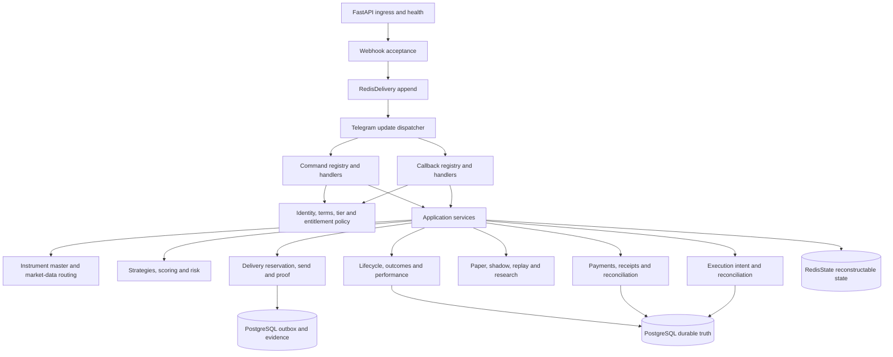
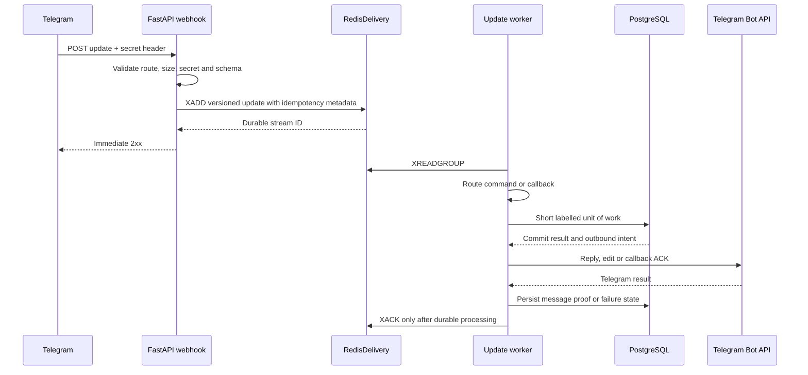
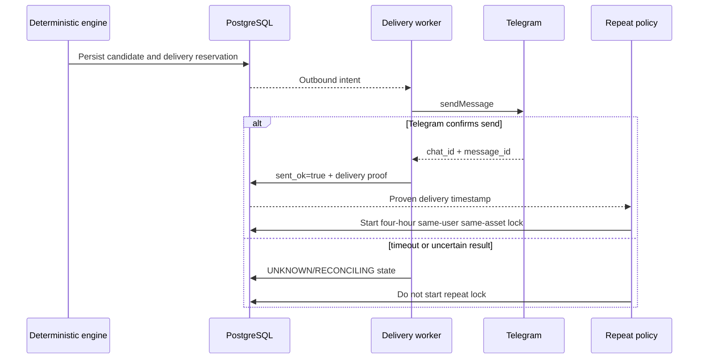
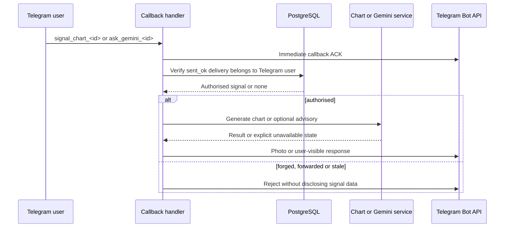
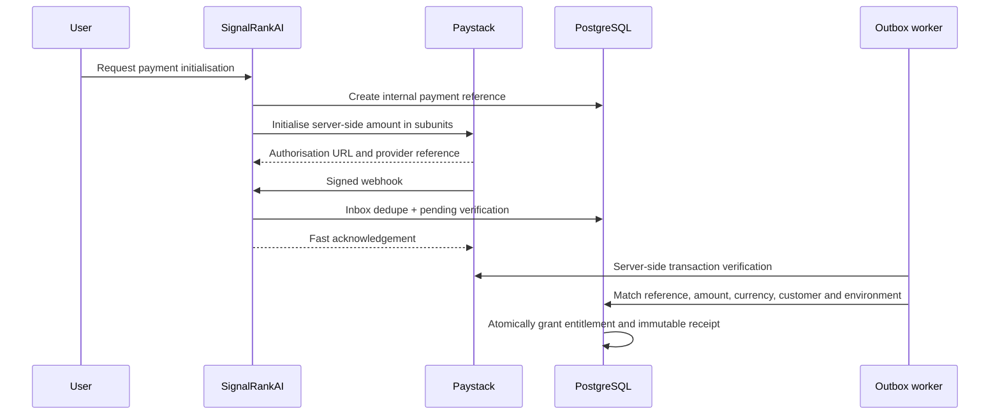
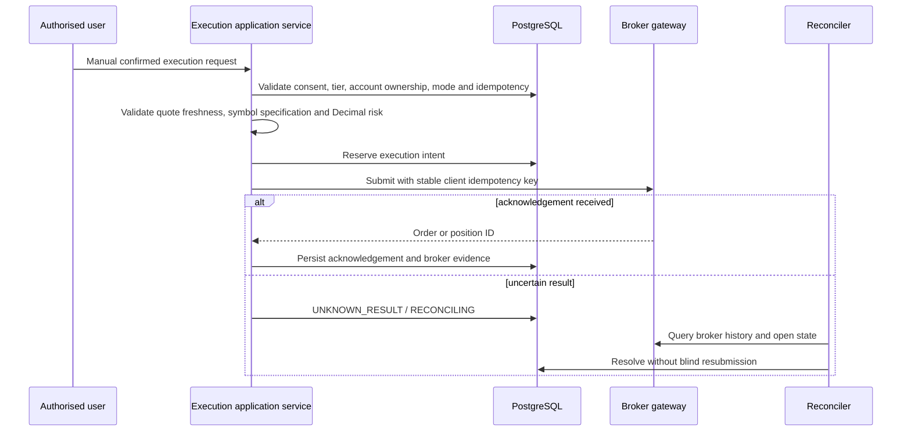
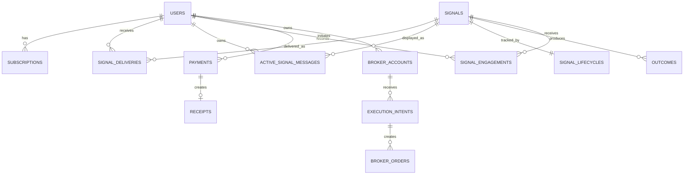

# SignalRankAI V7 Architecture and Critical Flows

**Status:** local repository architecture record  
**Date:** 2026-07-27  
**Deployment target:** Railway modular monolith, one replica and one Uvicorn worker initially

This document describes the architecture represented by the repository after the V7 hardening pass. It does not claim that externally dependent paths have been proven in Railway staging or live production.

## 1. System context

```mermaid
flowchart LR
    User[Telegram user] --> TG[Telegram Bot API]
    TG --> WH[Railway FastAPI webhook ingress]
    TV[TradingView alerts] --> WH
    PS[Paystack webhooks] --> WH

    WH --> RD[(RedisDelivery streams)]
    RD --> APP[SignalRankAI modular monolith]
    APP --> PG[(PostgreSQL via PgBouncer)]
    APP --> RS[(RedisState)]
    APP --> TG

    APP --> MD[Certified market-data providers]
    APP --> GEM[Optional Gemini advisory]
    APP --> META[MetaApi demo broker gateway]

    subgraph Disabled by default
      PAY[Public paid activation]
      EXEC[Real-money execution]
      COPY[Copy trading]
      DCA[Smart DCA]
    end
```

## 2. Runtime component boundaries



### Dependency rules

- Domain and policy code must not depend directly on FastAPI, Telegram SDKs, Redis clients, SQLAlchemy sessions, Paystack, MetaApi, Gemini, Railway, or provider SDKs.
- PostgreSQL is durable business truth. Redis is transport or reconstructable state.
- Network I/O occurs after the relevant database transaction closes.
- Public payments, real payouts, automatic trading, copy trading, real execution, live MT5 accounts, and WebSockets are fail-closed in the production example environment.

## 3. Telegram webhook acceptance



## 4. Proof-backed signal delivery and repeat protection



## 5. User-scoped signal callback



## 6. Payment convergence



Public payment activation remains disabled until Paystack test-mode E2E, replay, wrong-amount, refund, receipt, reconciliation, pricing, and legal gates pass.

## 7. Broker execution intent



Real execution remains disabled. MetaApi must first be proven with a dedicated demo account.

## 8. Core relational model



## 9. Activation boundary

The strongest evidence-supported state after this pass is **local repository hardened**. Railway staging, live Telegram probes, PgBouncer/PostgreSQL migration rehearsal, separate Redis services, provider certification, Paystack test-mode E2E, MetaApi demo execution, restore drills, and 24–72 hour soak remain separate release evidence gates.
